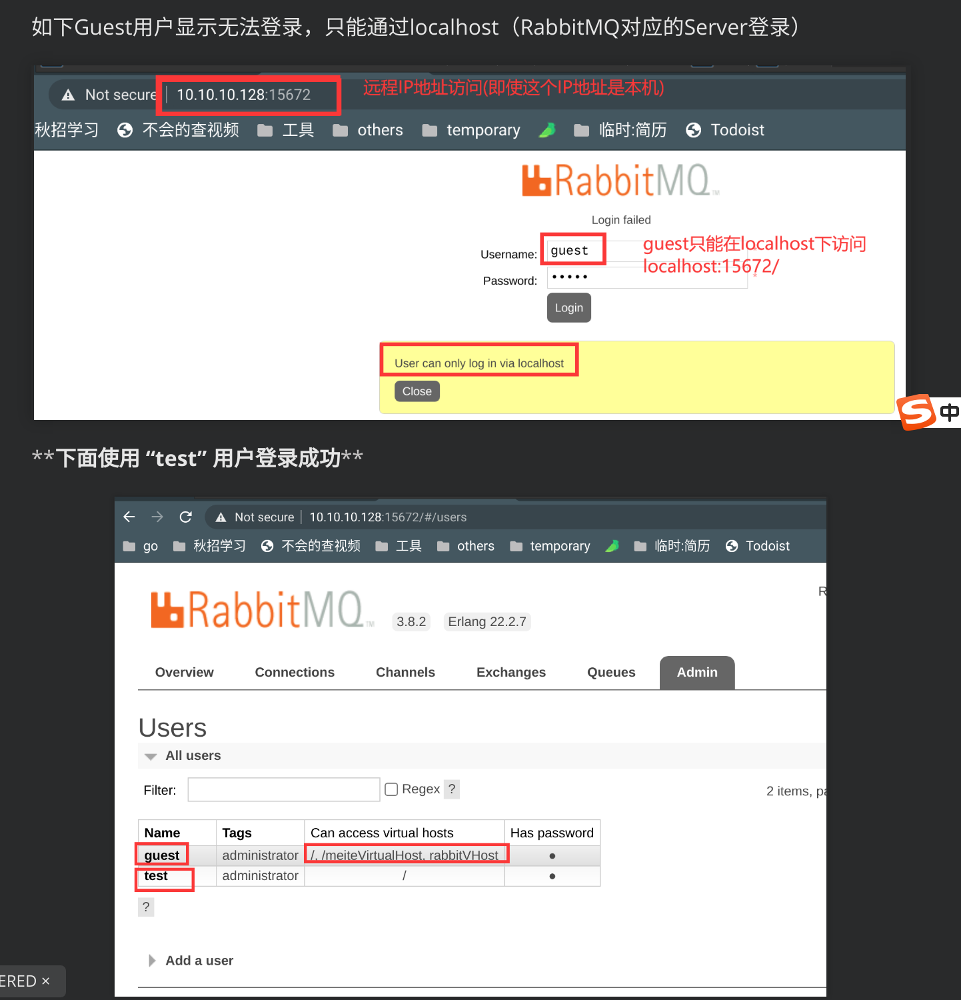

[toc]

> RabbitMQ上手教程


## 1. 启动停止MQ

```shell
#启动MQ
sudo rabbitmqctl start_app
#停止MQ
sudo rabbitmqctl stop
```


# 登录RabbitMQ平台

**本地登录**

地址：`http://localhost:15672/` 账号：guest 密码：guest  

该用户的密码账号都是默认的

guest只能在localhost登录


**远程登录**

地址：`http://serverIP:15672/` 

远程登录需要新建用户，其他Client才能访问 RabbitMQ Server

需要在RabbitMQ的服务器上创建admin用户，并开启对应端口，关闭防火墙。（具体见本目录下2 新建用户远程访问）



# 参考链接

[RabbitMQ入门简单清楚教程](https://www.cnblogs.com/keep-ambition/p/8038885.html)