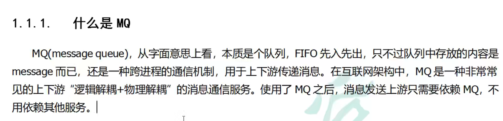
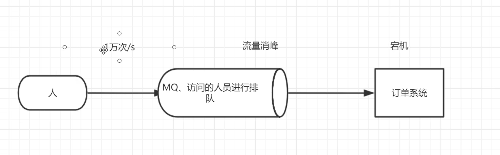
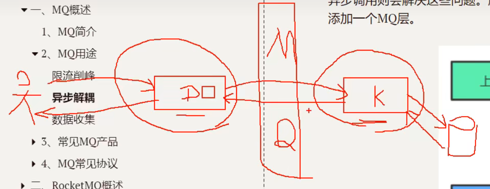
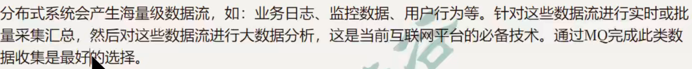
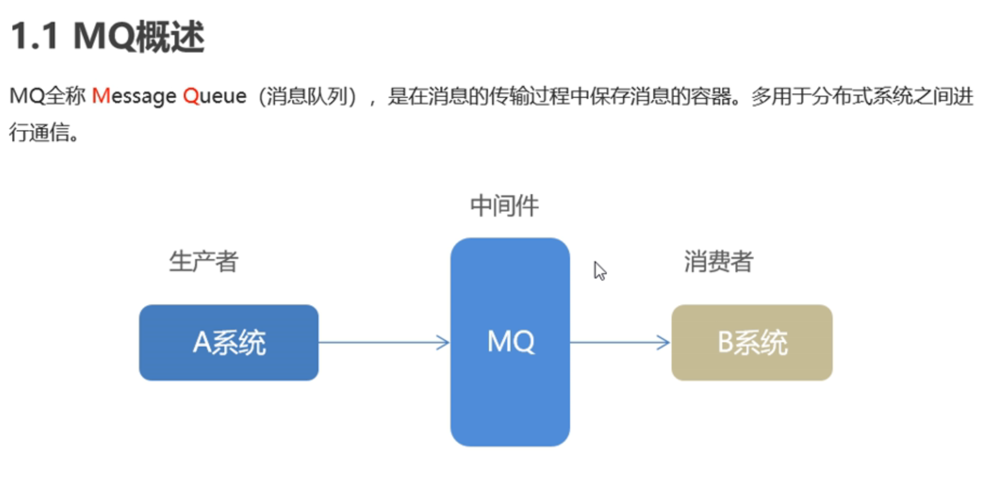
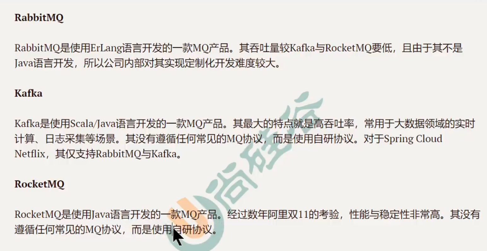
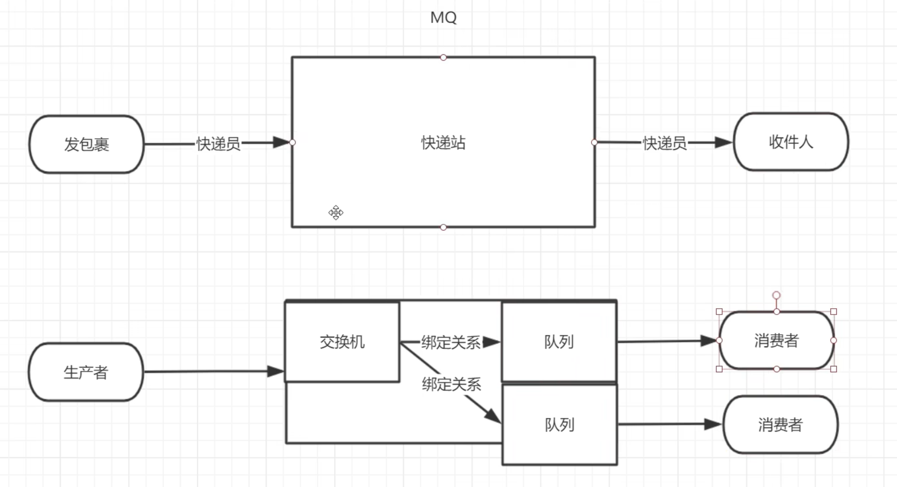

[toc]

# 一、MQ简介

MQ就是在上下游之间的消息队列，有了MQ(带缓存的channel)，发送方发送消息就不需要依赖于接收方

 

# 二、MQ的三大功能

## 1. 流量消峰

如果客户端大量的访问服务器，服务器会承受不住大量的访问而宕机。

因此需要在 Client and Server之间使用一个MQ消息队列，

MQ可以存储**超量**的请求，一边后续Server可以慢慢处理这些请求，避免了请求的丢失or Server的崩溃

**优点**

- 服务器不会因为大量的访问而停止工作

**缺点：**

- 大量访问因为要排队而访问等待时间高于原来，可能十几秒，但等待总比Server直接崩溃而无法访问的好

## 2. 异步解耦

MQ将同步调用的系统改为异步调用，降低系统之间的耦合度

**出现问题**：

如下图(假设还没有中间的MQ)，一个用户下单的流程是这样的：

用户下单 -> D订单系统处理请求，生成订单 -> 请求库存系统修改库存K ->K操作 数据库； 

如果数据库中库存数量修改成功，一路返回，最后用户收到响应，订单下单成功。

【同步调用】

如果 K库存系统操作 数据库一直失败呢？

**用户等待时间过长**， 大大降低了系统的吞吐量

> **前提**： 如果失败，库存系统将会一直 重复请求， 直到操作数据库成功为止。总之K库存系统一定会操作数据库成功。
>
> 直到操作成功后，再返回请求，一路返回，最终用户收到下单成功的返回 

**解决问题：**

实际上 `用户下单成功` 这个事情只与 D订单系统 有关， 而 K库存系统 是否修改成功关系不大(始终会成功)。

因此我们可以在 D订单系统 与 K库存系统之间添加 MQ消息队列， 

- 用户下单请求发出后，订单系统生成订单，并立即给用户反馈 【减少用户等待时间，增大吞吐量】
- 同时订单系统将请求发送到MQ，K库存系统后面慢慢处理请求，即使修改库存需要花费很长的时间

> **同步变异步**
>
> 上面没有MQ的做法叫 : 【同步调用】
>
> 下面有MQ的做法叫 ： 【异步调用】 D订单系统与K库存系统变成异步调用
>
> **解耦**：
>
> 将 D订单系统 与 K库存系统 之间解耦合

## 3. 数据收集

用于收集海量的数据，实时采集or批量采集汇总

# 三、常见产品

# 四、核心概念

核心概念有： 生产者、消费者、交换机、队列

MQ类比于快递站

- 每个队列只能对应一个消费者 （如果两个消费者对应一个队列，则只有一个消费者能收到信息）

