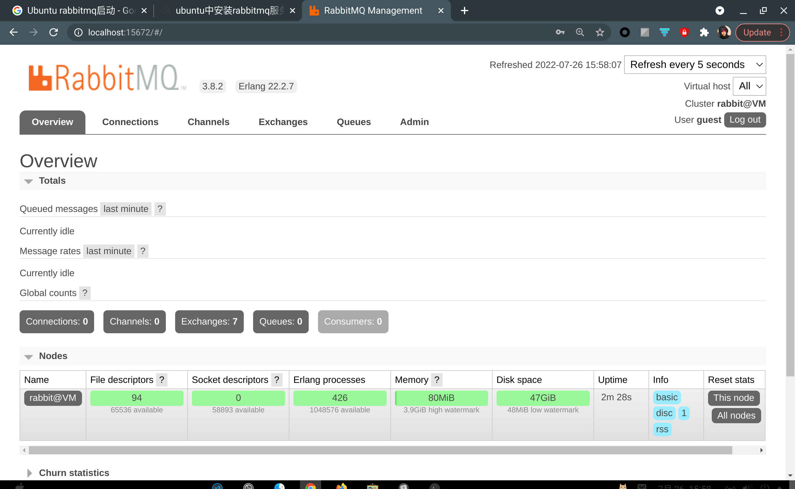

# 一、安装

## 1. 安装依赖erlang & rabbitMQ

[安装参考](https://wangxin1248.github.io/linux/2020/03/ubuntu-install-rabbitmq.html)

```shell
#安装erlang
sudo apt-get install erlang-nox
#rabbitMQ
sudo apt-get install rabbitmq-server
```


## 2. 安装 RabbitMQ web 管理插件

[插件以及启动参考链接](https://www.cnblogs.com/sui776265233/p/10954324.html)

```shell
sudo rabbitmq-plugins enable rabbitmq_management
```


## 3. 启动

1. 重启

```shell
sudo systemctl restart rabbitmq-server
```

2. 打开浏览器输入 `http://localhost:15672`，默认用户名密码：`guest/guest`



