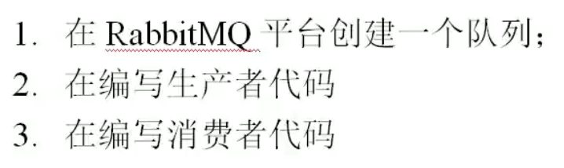
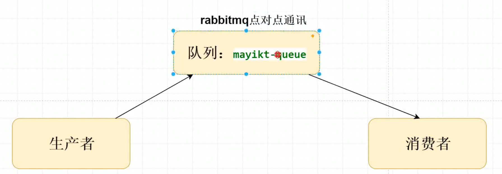
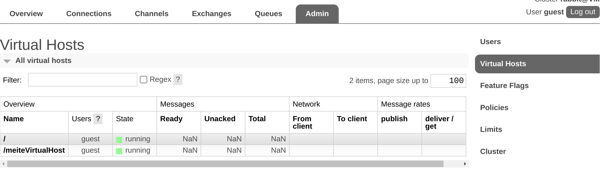
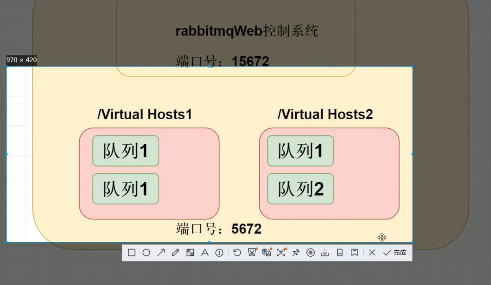
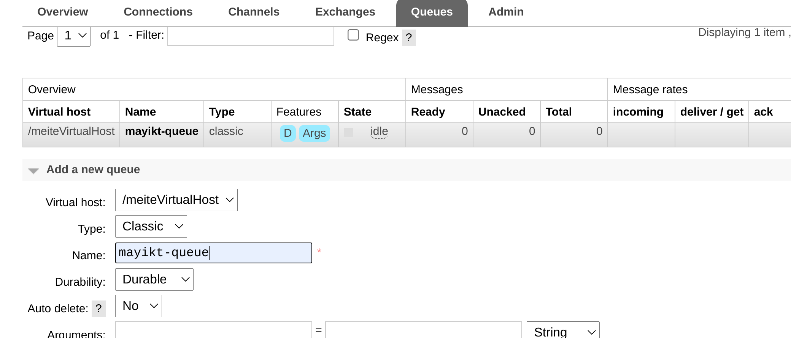
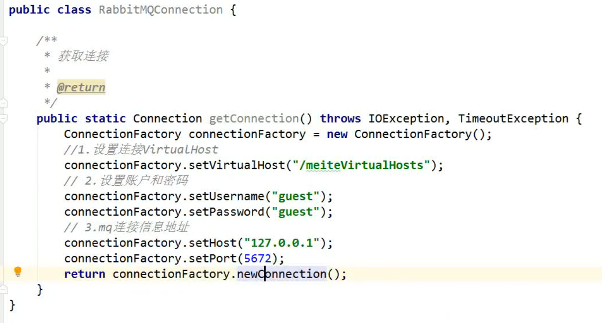
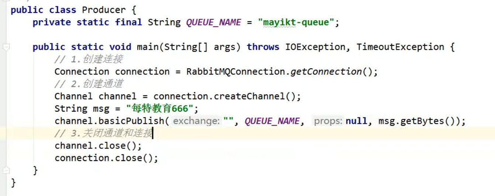
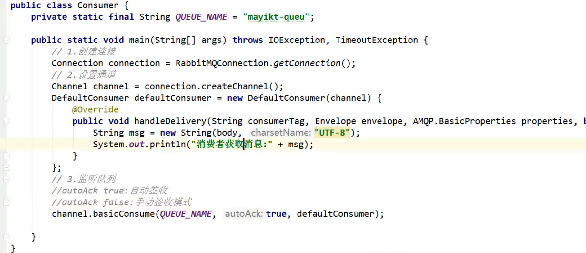

[toc]

# 入门

1首先创建virtual host队列

  

### 1 创建队列

1. 创建virtual host

2. 创建队列

   

   选择队列所属分类

    

### 2 编写生产者代码

1. 创建链接

   指定virtual host

   设置账户密码

   MQ链接信息的地址

2. 生产者

   设置消息时， 包含交换机(这里我们没有交换机所以为null)、指定队列名称、消息内容

   

   

### 3 消费者

autoAck = true ： 表示自动签收；消费者只要拿到消息，就把MQ中的消息删除

- 自动签收的弊端：如果消费者拿到message之后消费失败，就需要重试，重新向MQ获取消息，而如果设置自动签收，此时消息已经被删除了
- 解决方案：**手动签收**： 消费成功没有报错的情况下，才会签收消息，删除MQ中的消息

