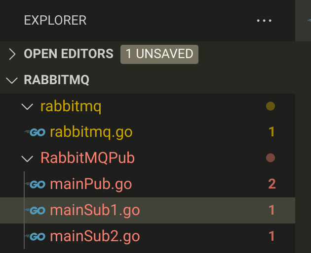

# 一、订阅模式

Publish / subscribe

## 1. 理论

**特点**：

消息被路由投递给多个队列，一个消息可以被**多个消费者获取并消费**


X表示交换机


## 2. 代码实现

### 1. 创建实例

```go
// 1. 创建实例
// 需要传入交换机
func NewRabbitMQPub(exchange string) *RabbitMQ {
	// 指定交换机
	return NewRabbitMQ(exchange, "", "")
}
```


### 2. 生产

为什么不申请队列:在消费者端申请

#### 1)申请交换机

```go
// 2. 生产者
func (r *RabbitMQ)PublishPub(message string) {
	// 1. 创建交换机
	err := r.channel.ExchangeDeclare(
		// name string, 
		r.Exchange,
		// kind string, 交换机类型:sub订阅模式是扇型类型
		"fanout", 
		// durable bool, 
		true,
		// autoDelete bool,true表示这个交换机不能被客户端用来推送消息，只能用于exchange之间的绑定
		false, 
		// internal bool, 
		false,
		// noWait bool, 
		false,
		// args amqp.Table:额外参数
		nil,
	)
	if err != nil {
		log.Printf("%s:%s", err, "exchange交换机创建失败！")
	}
```


#### 2)发送消息

Key为什么是空:发送到所有队列中


```go
// 2. 生产者
func (r *RabbitMQ)PublishPub(message string) {
	....
   	// 2. 生产消息
	r.channel.Publish(
		// exchange string, 
		r.Exchange,
		// key string,
		"", 
		// mandatory bool, 
		false,
		// immediate bool, 
		false,
		// msg amqp.Publishing
		amqp.Publishing{
			ContentType:"text/plain",
			Body: []byte(massage),
		},
	)
}
```


### 3. 消费端


#### 1） 创建交换机

消费端创建交换机与生产端一样

```go
func (r *RabbitMQ) ConsumerPub() {
	// 1. 申请交换机
	err := r.channel.ExchangeDeclare(
		// name string, kind string, durable bool, autoDelete bool, internal bool, noWait bool, args amqp.Table
		r.Exchange, "fanout", true, false, false, false, nil,
	)
	if err != nil {
		log.Printf("%s:%s", err, "Pub消费者创建交换机失败！")
	}
```


#### 2） 申请队列

- 队列名留空？ == 随机生成队列名称：为了后面用
- 排他性

```go
	// 2. 申请队列
	q, err := r.channel.QueueDeclare(
		// name string, durable bool, autoDelete bool, exclusive bool, noWait bool, args amqp.Table
		"", //队列名为空，表示随机生成
		false,
		false,
		true, //排他性
		false,
		nil, //额外
	)
	if err != nil {
		log.Printf("%s:%s", err, "Pub消费者创建queue失败！")
	}
```


#### 3）队列绑定交换机

q.Name是获取上面随机生成的队列名称

为什么Key为空:exchange要发送消息到所有queue上

```go
	// 3. 绑定交换机与队列
	err = r.channel.QueueBind(
		// name string, key string, exchange string, noWait bool, args amqp.Table
		q.Name, //queue名称是随机生成的
		"",     //发送到所有queue上
		r.Exchange,
		false,
		nil,
	)
	if err != nil {
		log.Printf("%s:%s", err, "交换机与队列绑定失败~")
	}
```


#### 4）接受消费消息

接收消费消息与其他一样

```go
	// 4. 接收消息
	msgs, err := r.channel.Consume(
		// queue string, consumer string, autoAck bool, exclusive bool, noLocal bool, noWait bool, args amqp.Table
		q.Name, "", true, false, false, false, nil,
	)
	if err != nil {
		log.Printf("%s:%s", err, "Pub消费者接收消息失败！")
	}
	// 5. 消费消息
	forever := make(chan bool)
	fmt.Println("按ctrl+enter结束")
	for msg := range msgs {
		// 处理收到的消息
		log.Printf("Received message:%s", msg.Body)
	}

	<-forever
}
```


### 4. 运行



#### 生产消息

传入交换机的名称

```go
package main

import (
	"RabbitMQ/rabbitmq"
	"fmt"
	"strconv"
	"time"
)

// 生产者
func main() {
	// 创建
	rabbitmq := rabbitmq.NewRabbitMQPub("rabbitPubExchange")
	// 生产
	for i := 0; i < 20; i++ {
		rabbitmq.PublishPub("生产第" + strconv.Itoa(i) + "条消息")
		fmt.Println("生产第" + strconv.Itoa(i) + "条消息")
		time.Sleep(1 * time.Second)
	}
	fmt.Println("发送完毕")
}

```


#### 消费消息

两个消费者是一样的

```go
package main

import (
	"RabbitMQ/rabbitmq"
)

func main() {
	// 申请交换机
	rabbitmq := rabbitmq.NewRabbitMQPub("rabbitPubExchange")
	// 接收消息
	rabbitmq.ConsumerPub()
}
```


### 5. 运行结果


结果显示：

消息可以被多个消费者消费，消息传递给多个消费者


  