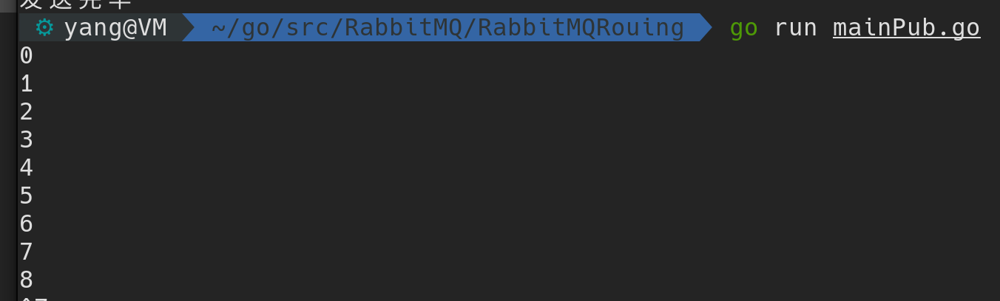
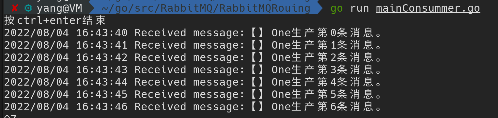
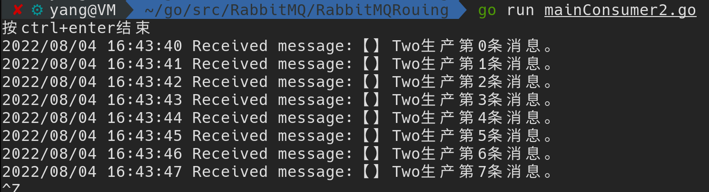

# 一、路由模式

## 1. 理论

> 1. 一个消息可以被多个消费者获取，
> 2. 生产者可以指定目标队列。


exchange通过routingKey来指定发送到对应的queue中。


## 2. 代码

### 创建实例

> 与订阅模式的区别：
>
> - 创建的exchange需要绑定 **routingKey**

```go
// 1. 创建实例
// 相比订阅模式多了routingKey
func NewRabbitMQRouting(exchange, routingKey string) *RabbitMQ {
	return NewRabbitMQ(exchange, "", routingKey)
}
```


### 生产端

> 与Publish模式最大的不同是：
>
> 1. exchange类型为direct
> 2. 发送消息时候要给exchange指定对应的routingKey以确定发送到对应的queue

```go
func (r *RabbitMQ) PublishRouting(message string) {
	err := r.channel.ExchangeDeclare(
        //区别1：exchange的模式为 direct
		r.Exchange, "direct", true, false, false, false, nil,
	)
	if err != nil {
		log.Fatalf("%s:%s", err, "routing模式生产者申请交换机出错")
	}
	r.channel.Publish(
        //区别2：发送消息需要确定routingKey，来发送到指定队列
		r.Exchange, r.Key, false, false, amqp.Publishing{ContentType: "text/plain", Body: []byte(message)},
	)
}
```


修改exchange的类型为direct类型


生产消息：

指定queue：需要设置routingKey


### 消费端

> 与订阅模式区别：
>
> 1. 交换机设置direct模式
> 2. 绑定exchange需要routineKey
>
> 其他的都一样

**区别一：交换机类型**


**区别二：绑定queue设置routingKey**


```go
func (r *RabbitMQ) ConsumerRouting() {
	err := r.channel.ExchangeDeclare(
		r.Exchange, "direct", true, false, false, false, nil,
	)
	if err != nil {
		log.Printf("%s:%s", err, "Routing消费者创建交换机失败！")
	}
	q, err := r.channel.QueueDeclare(
		"",false,false,true, //排他性
		false,
		nil, //额外
	)
	if err != nil {
		log.Printf("%s:%s", err, "Routing消费者创建queue失败！")
	}
	err = r.channel.QueueBind(
		q.Name, //queue名称是随机生成的
		r.Key,
		r.Exchange,
		false,
		nil,
	)
	if err != nil {
		log.Printf("%s:%s", err, "交换机与队列绑定失败~")
	}
	// 4. 接收消息
	msgs, err := r.channel.Consume(
		// queue string, consumer string, autoAck bool, exclusive bool, noLocal bool, noWait bool, args amqp.Table
		q.Name, "", true, false, false, false, nil,
	)
	if err != nil {
		log.Printf("%s:%s", err, "Pub消费者接收消息失败！")
	}
	// 5. 消费消息
	forever := make(chan bool)
	fmt.Println("按ctrl+enter结束")
	for msg := range msgs {
		// 处理收到的消息
		log.Printf("Received message:%s。", msg.Body)
	}

	<-forever
}
```


## 3. 运行(重点)


### 生产端

生产消息：

1. 设置了两个RabbitMQ ：对应两个routineKey
2. 消费者生产者三个对应的exchange都要一样

```go
func main() {
	// 创建2个Routing不同的RabbitMQ
	rabbitmqOne := rabbitmq.NewRabbitMQRouting("RoutingExchange", "keyOne")
	rabbitmqTwo := rabbitmq.NewRabbitMQRouting("RoutingExchange", "keyTwo")
	// 生产：RoutingKey不同的两个生产，生产不同的消息
	for i := 0; i < 20; i++ {
		rabbitmqOne.PublishRouting("【】One生产第" + strconv.Itoa(i) + "条消息")
		rabbitmqTwo.PublishRouting("【】Two生产第" + strconv.Itoa(i) + "条消息")
		fmt.Println(i)
		time.Sleep(1 * time.Second)
	}
	fmt.Println("发送完毕")
}
```


### 消费端

> 两个消费者绑定不同的routineKey，他们只消费routineKey相同的exchange发来的消息

```go
func main() {
	// 申请交换机
	rabbitmq := rabbitmq.NewRabbitMQRouting("RoutingExchange", "keyOne")
	// 接收消息
	rabbitmq.ConsumerRouting()
}
```


```go
func main() {
	// 申请交换机
	rabbitmq := rabbitmq.NewRabbitMQRouting("RoutingExchange", "keyTwo")
	// 接收消息
	rabbitmq.ConsumerRouting()
}
```


## 4. 运行结果

两个消费者只收到了自己对应的绑定相同RoutingKey的生产者的消息





