# 一、Topic模式

## 1. 理论

通过通配符来指定消息发送到哪些queue

> 相比Routing：
>
> 1. Routing只能固定RoutingKey，这个可以匹配并发送到多个queue中
> 2. Exchange的类型是Topic


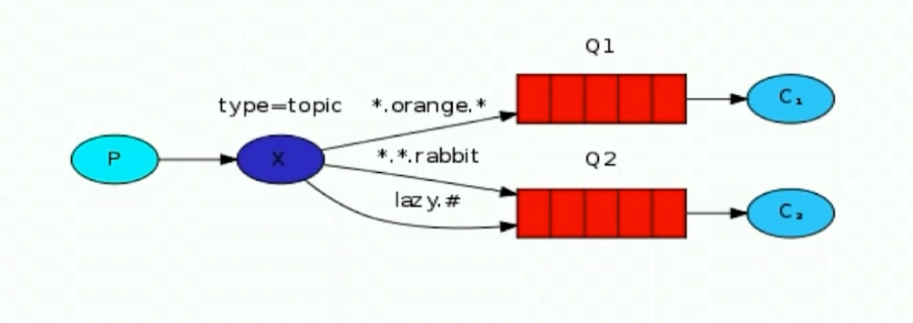


### 匹配规则

> 消费端设置bindingKey, 来匹配exchange的routingKey，匹配上了就接受
>
> > 具体实现见本节： 3运行.1)消费端的写法

`*`匹配一个单词， `#`匹配多个单词(>=0)

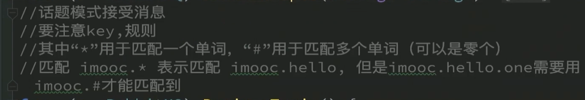

## 2. 代码实现


### 创建实例

**不同**

> 无区别

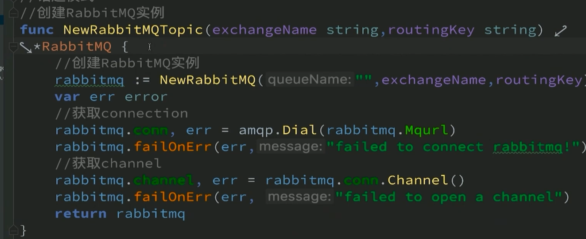

### 生产端

**不同**

> 创建exchange是Topic

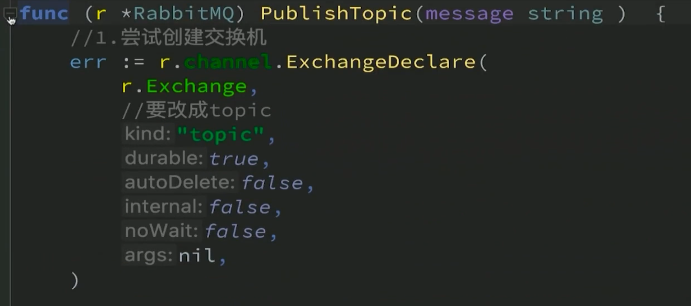

### 消费端

**不同**

> 只有交换机类型的不同

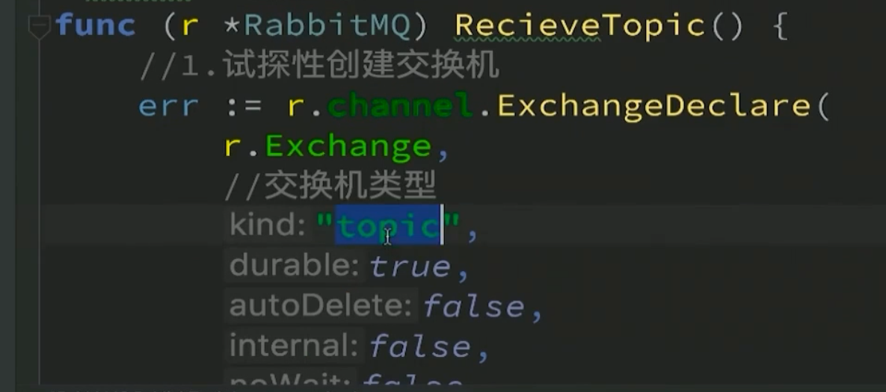

```go
// ================4 Topic======================

// 1. 创建实例
// 没有区别
func NewRabbitMQTopic(exchange, routingKey string) *RabbitMQ {
	return NewRabbitMQ(exchange, "", routingKey)
}

// 2. 生产者
// exchange类型是topic
func (r *RabbitMQ) PublishTopic(message string) {
	// 申请exchange
	err := r.channel.ExchangeDeclare(
		// name string, kind string, durable bool, autoDelete bool, internal bool, noWait bool, args amqp.Table
		r.Exchange, "topic", true, false, false, false, nil,
	)
	if err != nil {
		log.Fatalf("%s:%s", err, "Topic模式生产者申请交换机出错")
	}
	// 发送消息，绑定routingKey
	r.channel.Publish(
		// exchange string, key string, mandatory bool, immediate bool, msg amqp.Publishing
		r.Exchange, r.Key, false, false, amqp.Publishing{ContentType: "text/plain", Body: []byte(message)},
	)
}

// 3. 消费者
// exchange类型是Topic
func (r *RabbitMQ) ConsumerTopic() {
	// 1. 申请交换机
	err := r.channel.ExchangeDeclare(
		// name string, kind string, durable bool, autoDelete bool, internal bool, noWait bool, args amqp.Table
		r.Exchange, "topic", true, false, false, false, nil,
	)
	if err != nil {
		log.Printf("%s:%s", err, "topic消费者创建交换机失败！")
	}
	// 2. 申请队列
	q, err := r.channel.QueueDeclare(
		// name string, durable bool, autoDelete bool, exclusive bool, noWait bool, args amqp.Table
		"", //同样随机产生队列
		false,
		false,
		true, //排他性
		false,
		nil, //额外
	)
	if err != nil {
		log.Printf("%s:%s", err, "Routing消费者创建queue失败！")
	}
	// 3. 绑定交换机与队列
	err = r.channel.QueueBind(
		// name string, key string, exchange string, noWait bool, args amqp.Table
		q.Name, //queue名称是随机生成的
		r.Key,
		r.Exchange,
		false,
		nil,
	)
	if err != nil {
		log.Printf("%s:%s", err, "交换机与队列绑定失败~")
	}
	// 4. 接收消息
	msgs, err := r.channel.Consume(
		// queue string, consumer string, autoAck bool, exclusive bool, noLocal bool, noWait bool, args amqp.Table
		q.Name, "", true, false, false, false, nil,
	)
	if err != nil {
		log.Printf("%s:%s", err, "Pub消费者接收消息失败！")
	}
	// 5. 消费消息
	forever := make(chan bool)
	fmt.Println("按ctrl+enter结束")
	for msg := range msgs {
		// 处理收到的消息
		log.Printf("Received message:%s。", msg.Body)
	}

	<-forever
}
```


## 3. 运行


### 1)消费端


###### 获取ALL的消息

```go
package main

import (
	"RabbitMQ/rabbitmq"
)

// 与Subscribe不同：赋值Key:需要对应生产者的交换机

func main() {
	// 申请交换机：Key匹配所有RoutingKey
	rabbitmq := rabbitmq.NewRabbitMQTopic("TopicExchange", "#")
	// 接收消息
	rabbitmq.ConsumerTopic()
} 

```


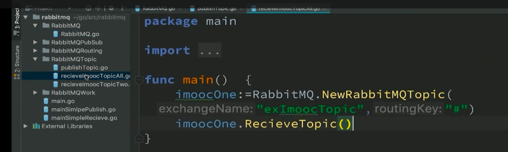

###### 获取One消息

```go
package main

import (
	"RabbitMQ/rabbitmq"
)

// 与Subscribe不同：赋值Key:需要对应生产者的交换机

func main() {
	// 申请交换机：Key匹配所有RoutingKey
	rabbitmq := rabbitmq.NewRabbitMQTopic("TopicExchange", "key.*.Two")
	// 接收消息
	rabbitmq.ConsumerTopic()
}
```


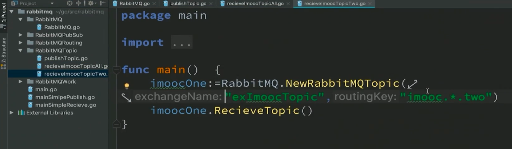

### 2)发送端

```go
package main

import (
	"RabbitMQ/rabbitmq"
	"fmt"
	"strconv"
	"time"
)

// 生产者
func main() {
	// 创建
	rabbitmqOne := rabbitmq.NewRabbitMQRouting("TopicExchange", "key.topic.One")
	rabbitmqTwo := rabbitmq.NewRabbitMQRouting("TopicExchange", "key.topic.Two")
	// 生产：RoutingKey不同的两个生产，生产不同的消息
	for i := 0; i < 20; i++ {
		rabbitmqOne.PublishTopic("One生产第" + strconv.Itoa(i) + "条消息")
		rabbitmqTwo.PublishTopic("Two生产第" + strconv.Itoa(i) + "条消息")
		fmt.Println(i)
		time.Sleep(1 * time.Second)
	}
	fmt.Println("发送完毕")
}
```


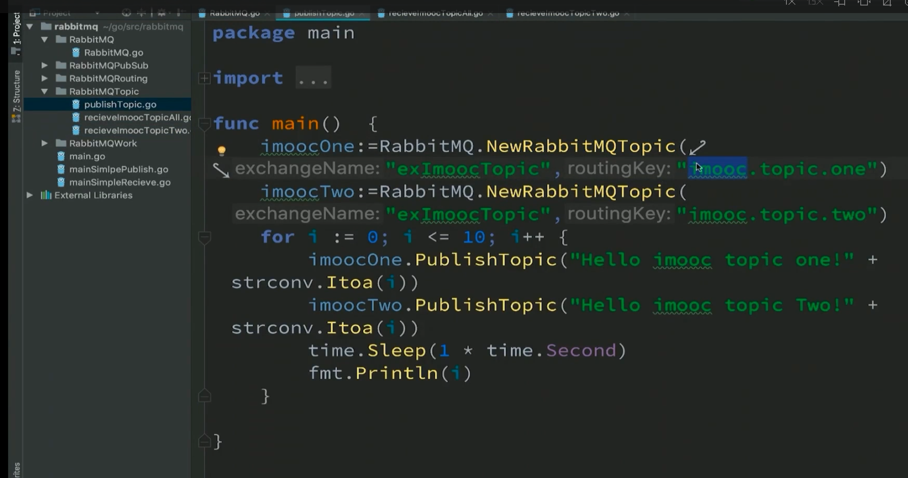


## 4. 运行结果


只消费了一个queue中的

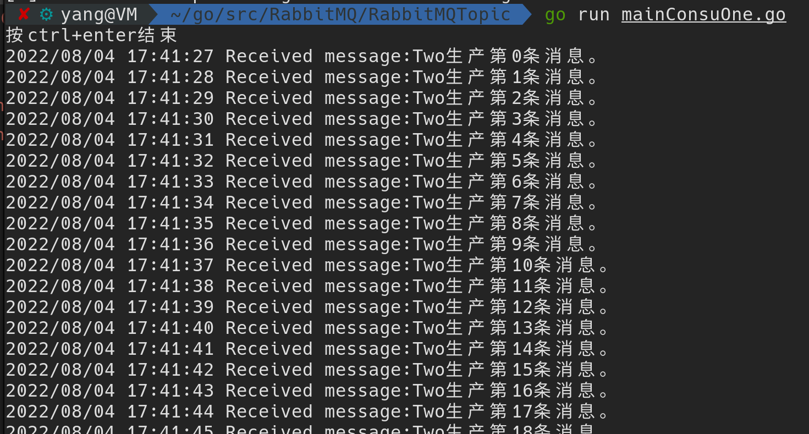

消费了两个queue中的

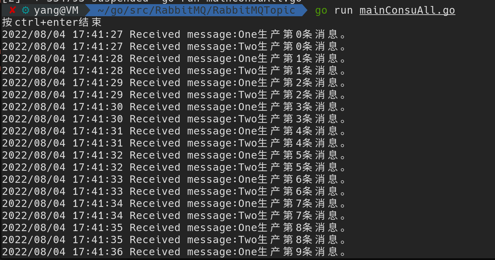


生产者

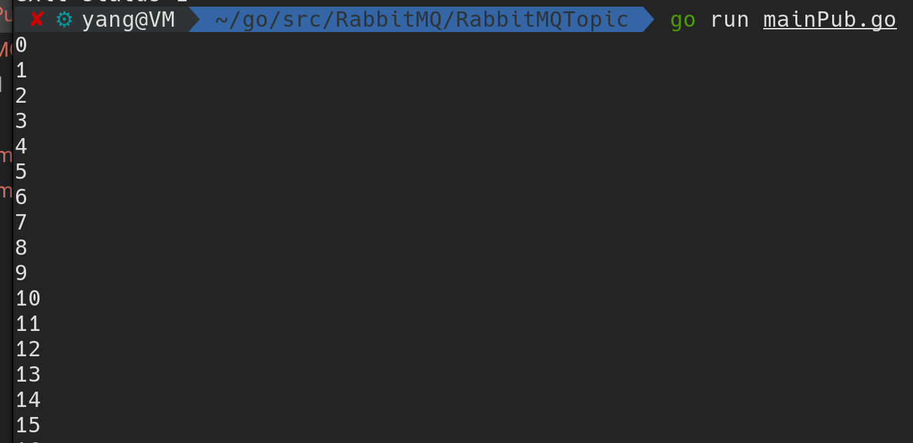