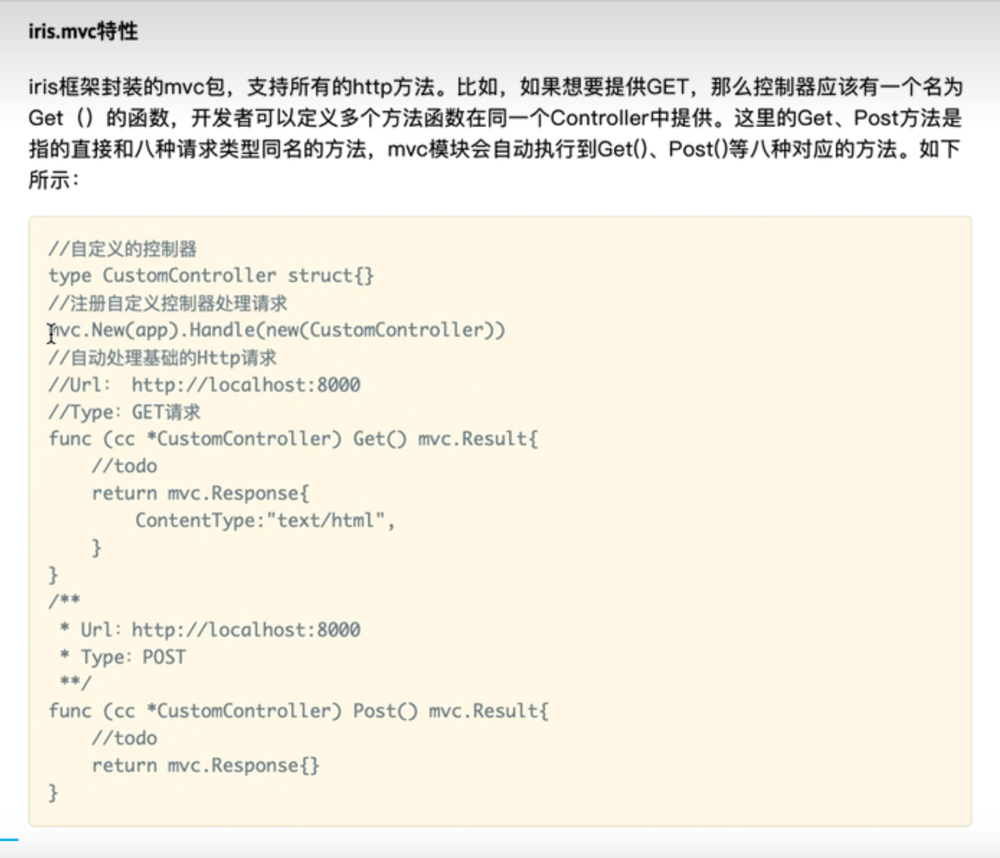
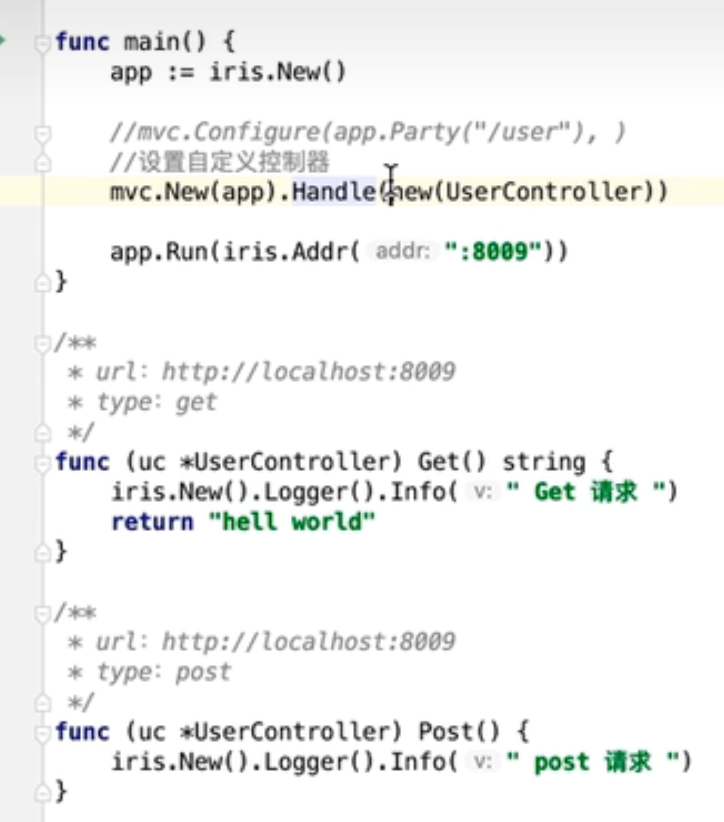
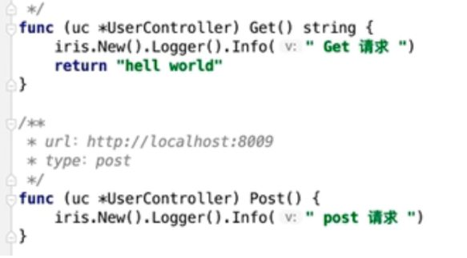
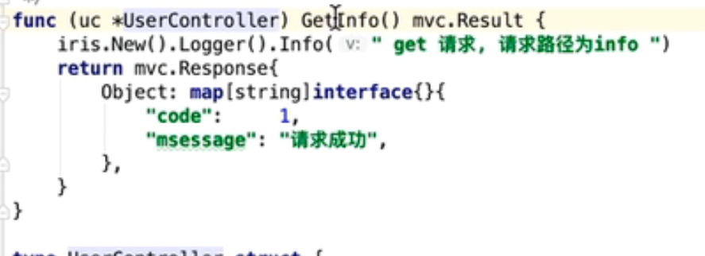
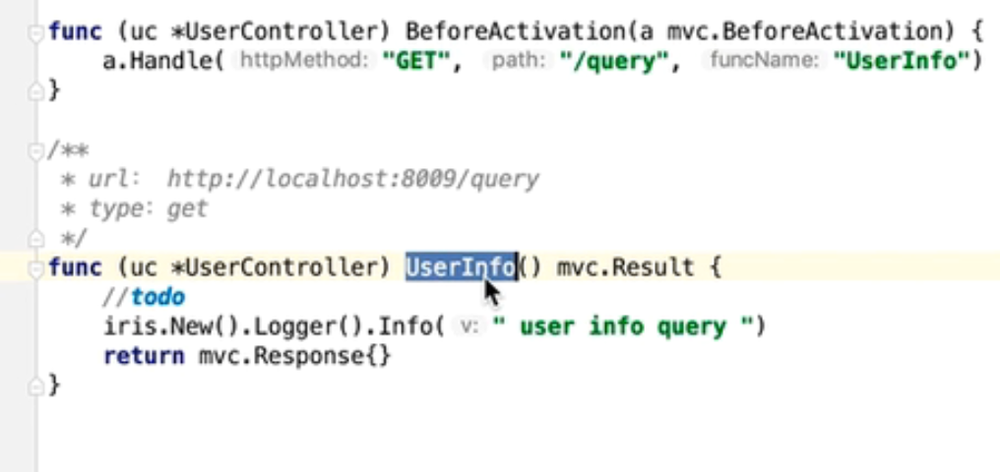
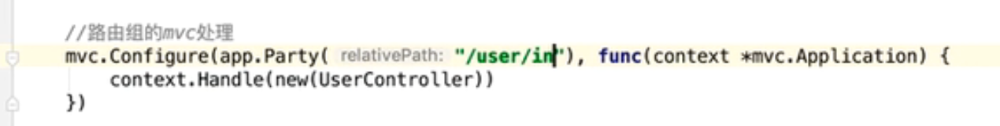

中断：

直接看这个示例[](https://learnku.com/docs/iris-go/10/mvc/3773)


# Iris的MVC特性

> 在根路径下：
>
> - 自定义控制器
> - 自动匹配
> - 默认匹配？？还没看到
> - 自定义匹配



```go
package main

import (
   "github.com/kataras/iris/v12"
   "github.com/kataras/iris/v12/mvc"
)
//自定义的控制器
type CustomController struct{}

//自动处理基础的Http请求
//Url： http://localhost:8000
//Type：GET请求
func (cc *CustomController) Get() mvc.Result{
   //todo
   return mvc.Response{
   	ContentType:"text/html",
   }
}
/**
* Url：http://localhost:8000
* Type：POST
**/
func (cc *CustomController) Post() mvc.Result{
   //todo
   return mvc.Response{}
}
func main() {
   app := iris.New()
   //注册自定义控制器处理请求
   mvc.New(app).Handle(new(CustomController))
   app.Run(iris.Addr(":8085"))
}

```




## 1. 默认匹配

直接写方法



> MVC的对于请求URL默认匹配、自动匹配、自定义匹配对应的function
>
> - 默认匹配：直接根据请求类型去匹配
> - 自动匹配：根据请求方法and请求路径等function
> - 自定义匹配：Before....自定义URL匹配的function

MVC包中可以自定义一个Controller

注册完Controller之后，可以在里面设置方法，当请求URL进来他会自动识别，并找到对应的路由，


## 2. 根据请求路径and请求方法自动匹配

注册路由：

>  命名规则是比如固定的吗？如果不那样命名会识别不到URL吗？

**规则**：请求方法 + 路径(首字母大写)。 

比如 localhost：8080/info...对应的方法名

GetInfo




## 3. 自定义匹配自定义对应的URL的function




## MVC处理路由组

如下：



处理的就是`/user/...`下面的比如 /user/info /user/下面的get请求、put请求等。

相比上面，上面的URL请求匹配都是建立在根路径下比如localhost:8080/，而处理路由组所有的处理是建立在路由组下面，比如localhost:8080/user/...下面


# 问题

下面自定义function时候如何去区分路由组的Controller and 根路径下的Controller呢？

每个Controller对应不同的路由组，

直接根目录的


