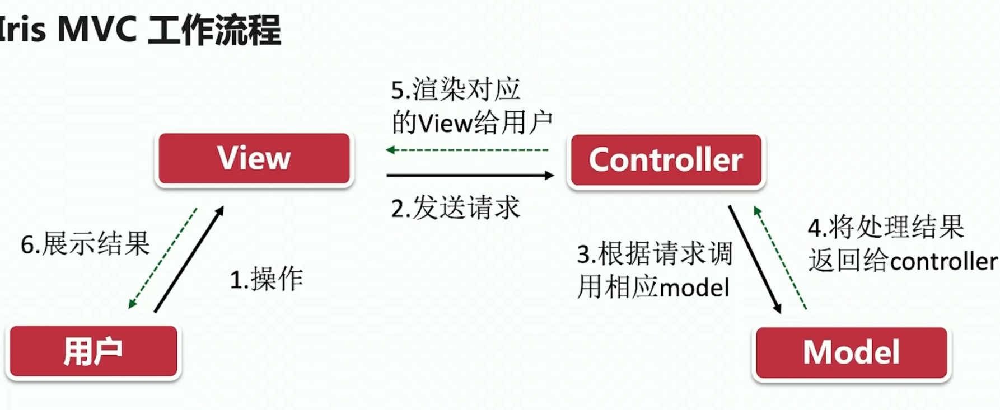
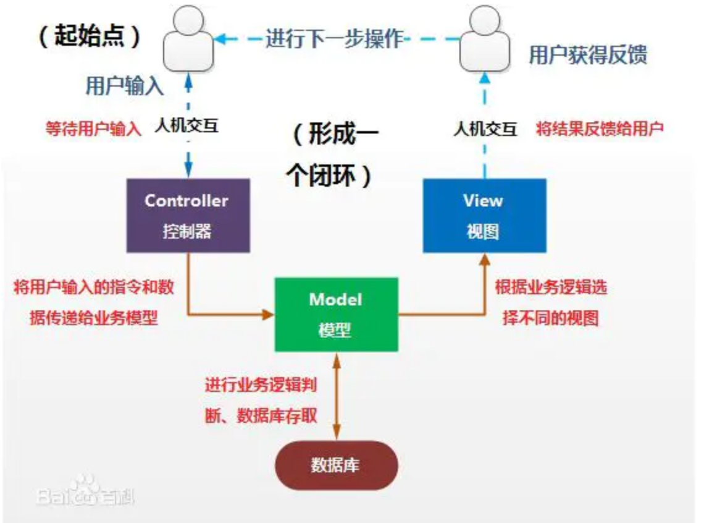

[toc]

# 一、MVC通俗解释

[【漫画编程】两分钟搞定 MVC 架构模式](https://www.bilibili.com/video/BV1mV411W7VT?spm_id_from=333.337.search-card.all.click&vd_source=47272764e1eb400edc65776bfe6a48af)

用户访问一个网站，服务器将页面展示给用户的整个过程有三个部分：

1. V：View 展示给用户的网页视图

2. M：model 当用户想要访问网站，则需要从服务器上去拉取整个网页，负责 **拉取网页** 功能的类就是 Model: 负责操作数据、业务逻辑

   

3. C：Controller 用户点击按钮，负责 **通知model去拉取信息** 的就是Controller
   - Controller 起到了中间人的作用，通知model拉取数据，拉取到数据后通知view即时显示数据

# 二、MVC官方

### 1 MVC是什么？

MVC是一种套路，一种模式

M = Model ：包含了对数据的操作、业务逻辑等

V = View ： 用户之间的交互界面

C = Controller ： 1. 接收来自界面的请求，并交给Model处理； 2. 接收Model返回的结果，选择对应的view交给他渲染

### 2 MVC的工作流程

# 三、MVC编程模式

[MVC的编程模式](https://www.jianshu.com/p/34c747668faa)

下面是一个MVC运行形成了闭环的图

