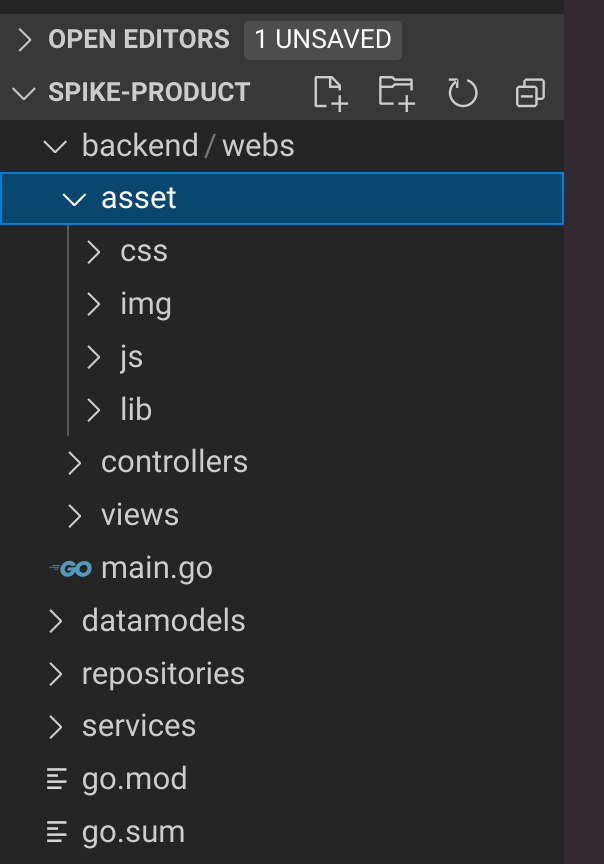

[toc]


# 一、结构搭建




1. **backend**: 

   放后端内容，webs、main、静态文件


2. **asset：静态文件**

​	包括css等等

​	lib ： js的分类、js的扩展


# 二、main.go入口

## 1. 创建实例

- 类似创建一个Engine

```go
app := iris.New()
```


## 2. 设置错误等级

[参考：八个日志等级](https://www.cnblogs.com/liushui-sky/p/8566970.html)

Available level names are: 

- off（关闭）
- fatal（致命）
- error（错误）
- warn（警告）
- info (the default)（信息（默认值））
- debug（调试）
- trace（跟踪）： 很低的日志级别一般不会使用

**DEBUG**：指出细粒度的信息事件，用于打印调试过程中的运行信息，只要对调试过程有帮助

**ERROR** 指出虽然发生错误事件，但仍然不影响系统的继续运行。打印错误和异常信息，如果不想输出太多的日志，可以使用这个级别。


```go
app.Logger().SetLevel("debug")
```


## 3. 注册动态模板

[模板注册官方文档(中文)](https://learnku.com/docs/iris-go/10/view/3778#863853)

#### **3.1动态模板示例**

```go
//　从　"./views"　目录下加载扩展名是".html" 　的所有模板，
//　并使用标准的　`html/template`　 包进行解析。
app.RegisterView(iris.HTML("./views", ".html"))

// Method:    GET
// Resource:  http://localhost:8080
app.Get("/", func(ctx iris.Context) {
    ctx.ViewData("message", "Hello world!") // 绑定： {{.message}}　为　"Hello world!"
    ctx.View("hello.html") // 渲染模板文件： ./views/hello.html
})
```

#### 3.2模板重载

允许在每个请求上自动重载模板。开发者开发模式时，不需要在每一次的模板编辑时都重启他们的应用

```go
pugEngine := iris.Pug("./templates", ".jade").Reload(true) // <--- 设置为　True，以便在每次请求时重新构建模板
app.RegisterView(pugEngine)
```


**本项目中：**

```go
// ==========================3.注册模板===================
// 3.1 模板文件准备
	// iris.HTML("文件相对根目录的位置", "以...结尾的文件")注册为模板
	// 绑定模板对应的layout文件：文件位置是基于template文件的位置，如views
template := iris.HTML(
    "./backend/webs/views", ".html").Layout(
    "shared/layout.html").Reload(true)
// 3.2 模板注册
app.RegisterView(template)
```


**模板注册** ： 将目录下的以 .html结尾的文件注册成模板，它对应的layout文件是 ....

再将模板放到app里面（相当于Engine）


## 4. 加载静态模板

[staticweb更改为HandleDir](https://chowdera.com/2022/01/202201310541248714.html)

静态模板加载路径设置： 第一个参数是访问的路径，第二个参数是项目中的静态文件夹。 当访问`/assets`开头的所有URL时， 会用 `./backend/web/assets`目录下的文件回应

```go
// 4. 设置模板目标:
app.HandleDir("/assets", "./backend/webs/assets")
```


## 5. 出现异常跳转到指定页面

[中文文档](https://learnku.com/docs/iris-go/10/error_handlers/3772)

> 为所有 >= 400的ErrorCode比如404 500 注册一个路由，自定义错误处理代码

#### 5.1 官方示例

- 对错误代码，注册一个handler。 例如当错误代码为404时，报错什么信息

```go
func (*router.APIBuilder).OnErrorCode(statusCode int, handlers ...context.Handler)
```


```go
func main(){
    ....
    //为具体某个状态码(>=400)注册处理器
    app.OnErrorCode(iris.StatusNotFound, notFound)
    app.OnErrorCode(iris.StatusInternalServerError, internalServerError)
    // 为所有的大于等于400的状态码注册一个处理器：
    // app.OnAnyErrorCode(handler)
    ......
}

//错误处理函数
func notFound(ctx iris.Context) {
   // 出现 404 的时候，就跳转到 $views_dir/errors/404.html 模板
    ctx.View("errors/404.html")
}

func internalServerError(ctx iris.Context) {
    ctx.WriteString("Oups something went wrong, try again")
}
```


#### 5.2 项目

```go
// 4.2 异常页面跳转
app.OnAnyErrorCode(func(ctx iris.Context) {
    // 绑定{{.message}}为 ctx.Values().GetStringDefault("message", "访问的页面出错"))
    ctx.ViewData("message",
        ctx.Values().GetStringDefault("message", "访问的页面出错"))
    ctx.ViewLayout("") // 没有layout文件
    ctx.View("shared/error/html")// 用数据，渲染html文件
})
```


### 6. 启动Run()

#### 6.1 Run()启动

.Run()第一个参数是监听对象，第二个参数是Configurator类型

```go
app.Run(iris.Addr("....:8080"))//监听端口并启动
```


#### 6.2 .Run的配置

```go
// 6.启动
app.Run(
    iris.Addr("localhost:8080"),
    // iris.WithoutVersionChecker,
    iris.WithoutServerError(iris.ErrServerClosed), //run返回的错误忽略
    // iris.WithOptimizations,
)
```

[官网关于配置的信息](https://learnku.com/docs/iris-go/10/configuration/3765)

1. 通过`app.Run`方法的第二个参数来进行相关的自定义配置项的配置，第二个参数是Configurator类型。


2. **配置有多种方式**：

​	[具体配置方式有](https://juejin.cn/post/7030087011906093064)

- toml,xml等配置文件

- 内建配置器：比如下面的直接写在Run函数中就是内建配置器


3. Run内建的配置器？？？？

- `WithoutServerError` 将会忽略从主应用的 `Run` 函数返回的 "errors"

  如果服务器的错误是 `http/iris#ErrServerClosed`，将返回 nil 


## Main.go全部代码

```go
package main

import (
	"github.com/kataras/iris/v12"
)

func main() {
	// =========================1.创建框架=====================
	app := iris.New()

	// =========================2.设置错误等级====================
	app.Logger().SetLevel("debug")

	// ==========================3.注册模板===================
	// 3.1 模板准备：指明模板位置
	// iris.HTML("文件相对根目录的位置", "以...结尾的文件")注册为模板
	// 绑定模板对应的layout文件：文件位置是基于template文件的位置，如views
	template := iris.HTML(
		"./backend/webs/views", ".html").Layout(
		"shared/layout.html").Reload(true)
	// 3.2 模板注册
	app.RegisterView(template)

	// ===========================4.设置模板目标:=============
	// requestPath 请求URL, directory string:访问项目中的文件路径
	// 4.1 静态模板加载：静态模板注册
	app.HandleDir("/assets", "./backend/webs/assets") // 原来是app.StaticWeb()
	// 4.2 异常页面跳转
	app.OnAnyErrorCode(func(ctx iris.Context) {
		// 绑定{{.message}}为ctx.Values().GetStringDefault("message", "访问的页面出错"))
		ctx.ViewData("message",
			ctx.Values().GetStringDefault("message", "访问的页面出错"))
		ctx.ViewLayout("") // 没有layout文件
		// 渲染html文件
		ctx.View("shared/error/html")
	}) //OnAnyErrorCode registers a handler which called when error status code written

	// 5. 控制器====================

	// 6.启动
	app.Run(
		iris.Addr("localhost:8080"),
		// iris.WithoutVersionChecker,
		iris.WithoutServerError(iris.ErrServerClosed), //run返回的错误忽略
		// iris.WithOptimizations,
	)
}
```


