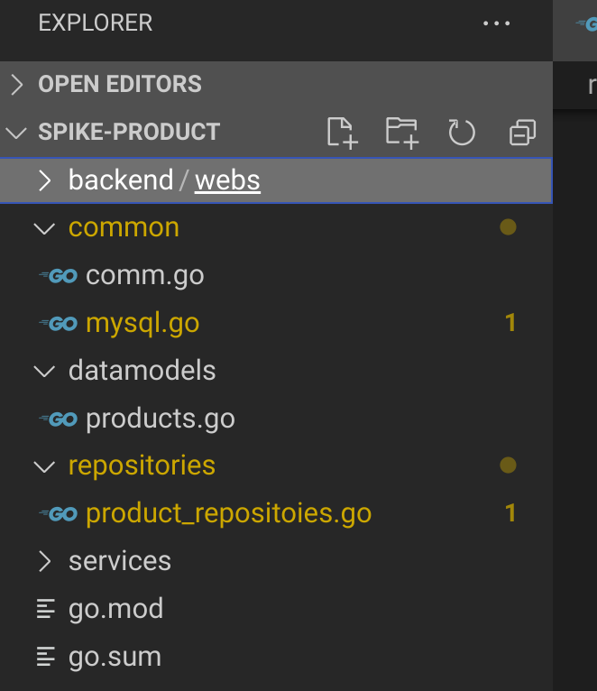

[toc]


**本节精华**

> 
>
> - 【反射机制；struct Tag】将从数据库中查询到的条目 对应的 装到结构体对象中
>
> 将数据库获得的内容data放置到需要的对象obj中
>
> ```go
> DataToStructByTagSql(data map[string]string, obj interface{}){
>     1. 根据obj中的名称，获取对应的data中的value "ID":"9527"
>  	2. 获取obj字段的名称 "ID"
>     3. 获取obj类型、data数据的类型;并将data的类型转换成obj需要的类型
>     4. 将data的数据填入到obj中
> 
> }
> ```


# 一、接口定义

1 定义接口：包含了增删查改

```go
// Step1： 开发对应接口
// Step2： 实现接口对应函数
type IProduct interface {
	// 数据库链接 ： 为什么product单独需要一个链接
	Conn() error
	// 增删查改
	Insert(*datamodels.Product) (int64, error) //返回插入数据的ID
	Delete(id int64) (bool, error)             //是否删除成功的结果
	SelectById(id int64) (*datamodels.Product, error)
	SelectAll() ([]*datamodels.Product, error) //返回多个product对应切片
	Update(*datamodels.Product) error
}
```


# 二、实现接口


### 1. 构造函数

```go
// 实现接口
type ProductManager struct {
	Table     string //Product表格的名字
	MysqlConn *sql.DB
}

// 构造函数
func NewProductManager(table string, db *sql.DB) IProduct {
	return &NewProductManager{Table: table, mysqlConn: db}
}
```

### 2. 创建数据库链接

```go
// 创建数据库链接
func (p *ProductManager) Conn() error {
	// 数据库连接
	if p.MysqlConn == nil {
		mysqlConn, err := common.NewMysqlConn()
		if err != nil {
			return err
		}
		p.MysqlConn = mysqlConn
	}
    // 给Product表命名
	if p.Table == "" {
		p.Table = "product"
	}
	return nil
}
```


### 3. 查:集成将result读入到结构体对象中


#### 反射机制

集成后的操作：**common.DataToStructByTagSql 将data填入到结构体对象**

```go
//根据obj结构体中sql标签映射 data数据到 obj结构体中并且转换类型
// data : 要传入的内容
// obj : 目标
func DataToStructByTagSql(data map[string]string, obj interface{}) {
	// 获取value
	objValue := reflect.ValueOf(obj).Elem() //目标结构体
	// 遍历目标结构体
	for i := 0; i < objValue.NumField(); i++ {
		//1. 获取sql对应的值：data["ID"] 目标结构体field中Tag中sql的值：ID productName
		value := data[objValue.Type().Field(i).Tag.Get("sql")] // 获取数据库中获得的data["ID"]
		//2. 获取对应字段的名称：目标结构体字段的名字：ID
		name := objValue.Type().Field(i).Name 
		//3. 获取对应字段类型：目标结构体类型： ID int64
		structFieldType := objValue.Field(i).Type()
        //4. 获取变量类型，也可以直接写"string类型"： "ID" : "9527"(string类型)
		val := reflect.ValueOf(value)
		var err error
		if structFieldType != val.Type() {
			//5. 类型转换：将 "9527"转换成9527
			val, err = TypeConversion(value, structFieldType.Name()) //类型转换
			if err != nil {
			}
		}
		//6. 设置类型值：将数据填充到目标结构体中
		objValue.FieldByName(name).Set(val)
	}
}
```


**查询**

```go
func (p *ProductManager) SelectById(productId int64) (product *datamodels.Product, err error) {
	// 1 检查
	if err = p.Conn(); err != nil {
		return
	}
	// 2. 执行查询语句
	sql := fmt.Sprintf("select * from %s where ID=%s", p.Table, productId)
	stmt, err := p.MysqlConn.Prepare(sql)
	if err != nil {
		return
	}
	row, err := stmt.Query(productId)
	if row.Err() != nil {
		err = row.Err()
		return
	}
	// 从数据库中获取到的所有内容
	result := common.GetResultRow(row)
	// 3. 将查询到的结果填入到结构体中
	common.DataToStructByTagSql(result, product)
	return
}
```

#### **类型转换**

```go
//类型转换
func TypeConversion(value string, ntype string) (reflect.Value, error) {
	if ntype == "string" {
		return reflect.ValueOf(value), nil
	} else if ntype == "time.Time" {
		t, err := time.ParseInLocation("2006-01-02 15:04:05", value, time.Local)
		return reflect.ValueOf(t), err
	} else if ntype == "Time" {
		t, err := time.ParseInLocation("2006-01-02 15:04:05", value, time.Local)
		return reflect.ValueOf(t), err
	} else if ntype == "int" {
		i, err := strconv.Atoi(value)
		return reflect.ValueOf(i), err
	} else if ntype == "int8" {
		i, err := strconv.ParseInt(value, 10, 64)
		return reflect.ValueOf(int8(i)), err
	} else if ntype == "int32" {
		i, err := strconv.ParseInt(value, 10, 64)
		return reflect.ValueOf(int64(i)), err
	} else if ntype == "int64" {
		i, err := strconv.ParseInt(value, 10, 64)
		return reflect.ValueOf(i), err
	} else if ntype == "float32" {
		i, err := strconv.ParseFloat(value, 64)
		return reflect.ValueOf(float32(i)), err
	} else if ntype == "float64" {
		i, err := strconv.ParseFloat(value, 64)
		return reflect.ValueOf(i), err
	}

	//else if .......增加其他一些类型的转换

	return reflect.ValueOf(value), errors.New("未知的类型：" + ntype)
}
```

#### SelectById

1. 将从数据库中查询到的数据放入一个data   map[string]string
2. 将data中的key，value一一对应的填充到结构体对象中：
   - 反射获取结构体对象中Tag中sql对应的名字，以便从map中获取到我们需要的value值
   - 将获取到的value值进行类型转换
   - 最后填入到结构体中


```go
原始操作：
rows, err := DB.Query("select * from testUser where id=?", id) //查询到多行用rows
for rows.Next() { 
    rows.Scan(&user.Id, &user.Username, &user.Sex, &user.Email) 
}
```


#### SelectAll

```go
func (p *ProductManager) SelectById(productId int64) (product *datamodels.Product, err error) {
	// 1 检查
	if err = p.Conn(); err != nil {
		return
	}
	// 2. 执行查询语句
	sql := fmt.Sprintf("select * from %s where ID=%s", p.Table, productId)
	row, err := p.MysqlConn.Query(sql)
	if row.Err() != nil {
		err = row.Err()
		return
	}
	// 从数据库中获取到的所有内容
	result := common.GetResultRow(row)
	// 3. 将查询到的结果填入到结构体中
	common.DataToStructByTagSql(result, product)
	return
}

func (p *ProductManager) SelectAll() (products []*datamodels.Product, err error) {
	// 1 检查
	if err = p.Conn(); err != nil {
		return
	}
	// 2. 执行查询语句
	sql := fmt.Sprintf("select * from %s", p.Table)
	rows, err := p.MysqlConn.Query(sql)
	if err != nil {
		return
	}
	// 从数据库中获取到的结果
	resMap := common.GetResultRows(rows)

	// 循环将所有结果先分别填入到结构体对象，再填入到总结构
	for _, data := range resMap {
		product := &datamodels.Product{}
		common.DataToStructByTagSql(data, product)
		products = append(products, product)
	}
	return
}
```


### 4. 增删改

- 每次执行SQL语句之前都要检查数据库是否链接成功

```go
// 增删查改

func (p *ProductManager) Insert(product *datamodels.Product) (ID int64, err error) { //返回插入数据的ID
	// 1. 检查链接是否成功
	if err = p.Conn(); err != nil {
		return
	}
	// 2. 插入数据
	sql := fmt.Sprintf("INSERT INTO %s(productName,productNum,productImage,productUrl) values(?,?,?,?)", p.Table)
	stmt, err := p.MysqlConn.Prepare(sql)
	if err != nil {
		return
	}
	// 3. 传入参数
	ret, err := stmt.Exec(product.ProductName, product.ProductNum, product.ProductImage, product.ProductUrl)
	if err != nil {
		return
	}
	return ret.LastInsertId()
}

// 删除
func (p *ProductManager) Delete(productId int64) (success bool, err error) { //是否删除成功的结果 //bool零值为false
	// 1 判断连接是否成功
	if err = p.Conn(); err != nil {
		return
	}
	// 2 删除数据
	sql := fmt.Sprintf("delete from %s where productId=?", p.Table)
	stmt, err := p.MysqlConn.Prepare(sql)
	if err != nil {
		return
	}
	_, err = stmt.Exec(productId)
	if err != nil {
		return
	}
	success = true
	return
}
//更新
func (p *ProductManager) Update(product *datamodels.Product) error {
	// 1 检查
	if err := p.Conn(); err != nil {
		return err
	}
	// 改
	sql := "update product set productName=?,productNum=?,productImage=?,productUrl  where ID=?"
	stmt, err := p.MysqlConn.Prepare(sql)
	if err != nil {
		return err
	}
	_, err = stmt.Exec(product.ProductName, product.ProductNum, product.ProductImage, product.ProductUrl, product.ProductUrl)
	if err != nil {
		return err
	}
	return nil
}
```


# 三、整体目录

