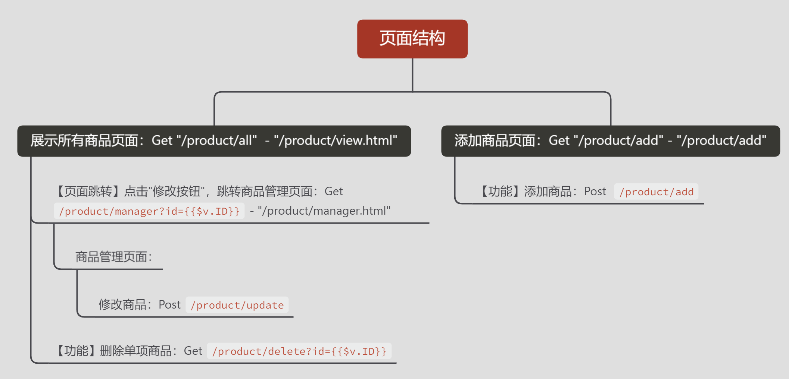
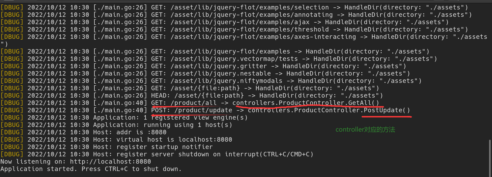

整体说明：

1. 在main中注册路由组对应的Controller：这个路由组(如/product)下面的请求都经过Controller去处理
2. 创建Controller，并绑定对应的Service逻辑处理器(Controller将进来的请求转发给Service处理，之后从service获取内容，并渲染给View)


# 一、创建Controller的方法

### 方法一：在main中直接注册Controller

**步骤：**

1. 在main中注册Controller
2. 注册Controller需要的Context、Service逻辑处理器,以便于初始化Controller

```go
//连接数据库
db, _ := common.NewMysqlConn()
// 创建上下文
ctx, cancel := context.WithCancel(context.Background())
defer cancel()

// 5. 控制器====================
productRepository := repositories.NewIProductManager("product", db)     //创建repository
productSerivce := services.NewIProductServiceManager(productRepository) //创建service
productParty := app.Party("/product") //指定商品的路由组
product := mvc.New(productParty)// mvc创建一个product的路由组
product.Register(ctx, productSerivce)                   // 将路由组的上下文and逻辑处理器注册进去
product.Handle(new(controllers.ProductController))
```

3. 创建Controller ： 在Controller文件夹中

```go
type ProductController struct {
	Ctx            iris.Context
	ProductService services.IProductService
}
```

4. 相关函数使用
   - 在方法中使用service

```go
func (p *ProductController) GetAll() mvc.View {
	productArray, _ := p.ProductService.GetAllProduct()
	return mvc.View{
		Name: "product/view.html",
		Data: iris.Map{
			"productArray": productArray,
		},
	}
}
```

### 方法2:通过在Controller中创建NewController的方法来创建Controller

- 在Controller中就初始化好，main中直接调用方法即可创建Controller
- 如果需要注入别的内容在struct中，则可以在main中继续使用app.Regiester()

**main.go**

```go
ctx, cancel := context.WithCancel(context.Background()) //如何创建的context
defer cancel()
// 5.==================控制器
product := mvc.New(app.Party("/product"))
product.Register(ctx)                             //将context注册进路由组product
product.Handle(controller.NewProductController()) //绑定对应的Controller
```


**Controller.go的代码**：

```go
import (
	"Spike-Product-Demo/common"
	"Spike-Product-Demo/repository"
	service "Spike-Product-Demo/services"

	"github.com/kataras/iris/v12"
	"github.com/kataras/iris/v12/mvc"
)

// product对应的Controller

// =====================创建Controller对象(类似于MVC里面的engine)
// struct中的对象都在main中注册好，类似Engine中的Context都在main中注册好
type ProductController struct {
	Ctx            iris.Context            //这个Controller的上下文
	ProductService service.IProductService // Service逻辑处理
}

func NewProductController() *ProductController {
	db, _ := common.NewMysqlConn()
	repositoryProduct := repository.NewIProductManager("product", db)
	return &ProductController{ProductService: service.NewIRoductSeviceManager(repositoryProduct)}
}
```


为什么Service不在Controller函数内部调用，而是要注册到struct里面？

- 在Controller的函数中每个函数都需要用到service，context。 通过注册struct的方式可以减少代码冗余


# 二、Controller相关方法


## 0.Controller自动匹配的方法


- 显示所有商品详情：

  - **显示**商品详情：Get 请求/product/all - 页面/product/view.html 
  - **跳转**商品管理页面： Get `/product/manager?id={{$v.ID}}`
    - 商品修改功能：提交表单 Post `/product/update`
  - 删除商品**功能**： Get `/product/delete?id={{$v.ID}}`

- 添加商品页面 ：

  - 显示商品详情页面： Get 请求/product/add - 页面/product/add.html 

    商品添加页面：

    - 按钮“添加”: Post 请求/product/add




下面Controller自动匹配的几个方法：

```go

// 1. 显示所有商品 Get /product/all 显示商品详情页面：获取所有商品
// 自动匹配：用Get方法访问/product/all会调用该方法
func (p *ProductController) GetAll() mvc.View {
	// 调用Service去获取数据
	// productArray, _ := p.ProductService.GetAllProduct()
	// 渲染view
	productArray, _ := p.ProductService.GetAllProduct()
	return mvc.View{
		Name: "product/view.html",
		Data: iris.Map{
			"productArray": productArray,
		},
	}
}

// 2. 商品管理页面 GET /product/manager：展示多条商品，页面有修改and删除操作按钮
func (p *ProductController) GetManager() mvc.View {
    //获取Get请求链接上带的参数:/product/delete?id=9
    idString := p.Ctx.URLParam("id")
	id, err := strconv.ParseInt(idString, 10, 16)
	if err != nil {
		p.Ctx.Application().Logger().Debug(err)
	}
	product, err := p.ProductService.GetProductByID(id)
	if err != nil {
		p.Ctx.Application().Logger().Debug(err)
	}

	return mvc.View{
		Name: "product/manager.html",
		Data: iris.Map{
			"product": product,
		},
	}
}

// 3. 修改商品功能 POST /product/update ： 提交修改商品表单
func (p *ProductController) PostUpdate() {
	// 1. 处理提交的表单，解析表单，将表单中的数据填充到product结构体里面
	product := &datamodels.Product{}
	p.Ctx.Request().ParseForm()                                       //解析上传的表单
	dec := common.NewDecoder(&common.DecoderOptions{TagName: "form"}) // 通过form解析传入的表单
	if err := dec.Decode(p.Ctx.Request().Form, product); err != nil { //将表单中的内容填充到product
		p.Ctx.Application().Logger().Debug(err) //debug级别的error
	}
	// 2. 更新数据库中的商品信息
	err := p.ProductService.UpdateProduct(product)
	if err != nil {
		p.Ctx.Application().Logger().Debug(err)
	}
	// 3. 更新完毕后跳转到指定页面
	p.Ctx.Application().Logger().Info("成功修改商品, ID为", product.ID)
	p.Ctx.Redirect("/product/all")
}

// 4. 删除商品 GET localhost:8080/product/delete
func (p *ProductController) GetDelete() {
	// 1. 获取商品ID
	idString := p.Ctx.URLParam("id")              //json中是id
	id, err := strconv.ParseInt(idString, 10, 16) //字符串转换：字符串，字符串进制，返回结果bit的大小
	if err != nil {
		p.Ctx.Application().Logger().Debug("GetDelete：数字转换错误", err)
	}
	// 2. Service删除商品
	err = p.ProductService.DeleteProductByID(id)
	if err != nil {
		p.Ctx.Application().Logger().Debug("删除商品失败，ID为：%i", id, err)
	}

	// 3. 跳转页面
	p.Ctx.Application().Logger().Info("成功删除商品, ID为", id)
	p.Ctx.Redirect("/product/all")
}

// 5. 添加商品页面 GET /product/add ：add.html
func (p *ProductController) GetAdd() mvc.View {
	return mvc.View{
		Name: "product/add.html",
	}
}

// 6. 添加商品按钮 POST /product/add：提交表单
func (p *ProductController) PostAdd() {
	// 1.获取HTML页面填写的表单信息 2.解析表单填充到数据库 3.跳转到展示所有商品页面
	product := &datamodels.Product{}
	p.Ctx.Request().ParseForm()                                         // 获取表单并解析
	dec := common.NewDecoder((&common.DecoderOptions{TagName: "form"})) // 通过Tag将表单内容填充到product
	if err := dec.Decode(p.Ctx.Request().Form, product); err != nil {
		p.Ctx.Application().Logger().Debug(err)
	}
	_, err := p.ProductService.InsertProduct(product)
	if err != nil {
		p.Ctx.Application().Logger().Debug(err)
	}
	p.Ctx.Application().Logger().Info("成功添加商品, ID为", product.ID)
	p.Ctx.Redirect("/product/all")
}
```

**成功结果**

- 请求/product/update时，Controller成功自动匹配到对应的PostUpdate()函数




> 下面是上面方法中需要用到的新的知识

## 1. mvc返回html页面


1. 【main.go】解析模板

   - layout的文件地址已经在HTML中被告知了，因此只需要给出相对地址，相对于前面iris.HTML已经注册的地址

   - Example: HTML("./templates", ".html").Layout("layouts/mainLayout.html")

     // mainLayout.html is inside: "./templates/layouts/"

   ```go
   tmplate := iris.HTML("./backends/webs/views", ".html").Layout("shared/layout.html").Reload(true)
   	app.RegisterView(tmplate)
   ```

   

2. 【controller.go中】Controller方法返回 `mvc.View`

   ` "product/view.html"`：此处一定要和文件夹路径一致， 文件夹中 `product /view.html`有个空格，就会和 Name:"product/view.html"不一致

   - iris.Map中的 {"productArray": productArray,}是传递给html页面使用的内容， `"productArray"`是在html中的名字， `pArray` 是后端的名字，将pArry传递给html页面后，html将通过 `.productArray`来获取 `pArray`中的内容
   
   ```go
   func (p *ProductController) GetAll() mvc.View {
   	pArray, _ := p.ProductService.GetAllProduct()
   	// 渲染view
   	return mvc.View{
   		Name: "product/view.html",
   		Data: iris.Map{
   			"productArray": pArray,
   		},
   	}
   }
   ```
   
   


## 2. 获取Get请求的参数

> 获取Get请求URL中后面带的参数， 如/product/delete?id=9 中的id的9

- 获取参数：`Ctx.URLParam("id")`

- `strconv.ParseInt(idString, 10, 16)`:

  ```go
  //将s string解析成base进制的，展示bit位
  func strconv.ParseInt(s string, base int, bitSize int) (i int64, err error)
  ```

  

```go
//获取Get请求链接上带的参数:/product/delete?id=9
idString := p.Ctx.URLParam("id")
id, err := strconv.ParseInt(idString, 10, 16)
//将参数传入到Service中
product, err := p.ProductService.GetProductByID(id)
```


## 3. 表单提交

> 获取页面中的信息，解析，转发给Service
>
> 如：用户在主页填写的个人信息，需要Controller Function解析出来之后，转发给Service处理

- `p.Ctx.Request().ParseForm()` : 解析表单
- `p.Ctx.Request().Form`：解析后的表单

```go
p.Ctx.Request().ParseForm()                                       //解析上传的表单
//这一句是调包
dec := common.NewDecoder(&common.DecoderOptions{TagName: "form"}) // 通过form解析传入的表单
if err := dec.Decode(p.Ctx.Request().Form, product); err != nil { //将表单中的内容填充到product
    p.Ctx.Application().Logger().Debug(err) //debug级别的error
}
// 2. 更新数据库中的商品信息
err := p.ProductService.UpdateProduct(product)
```


