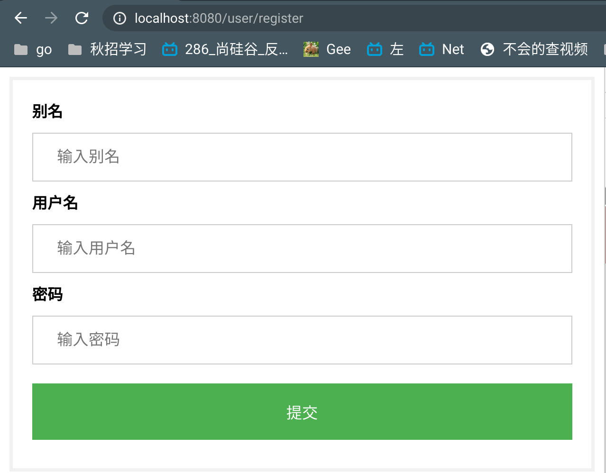
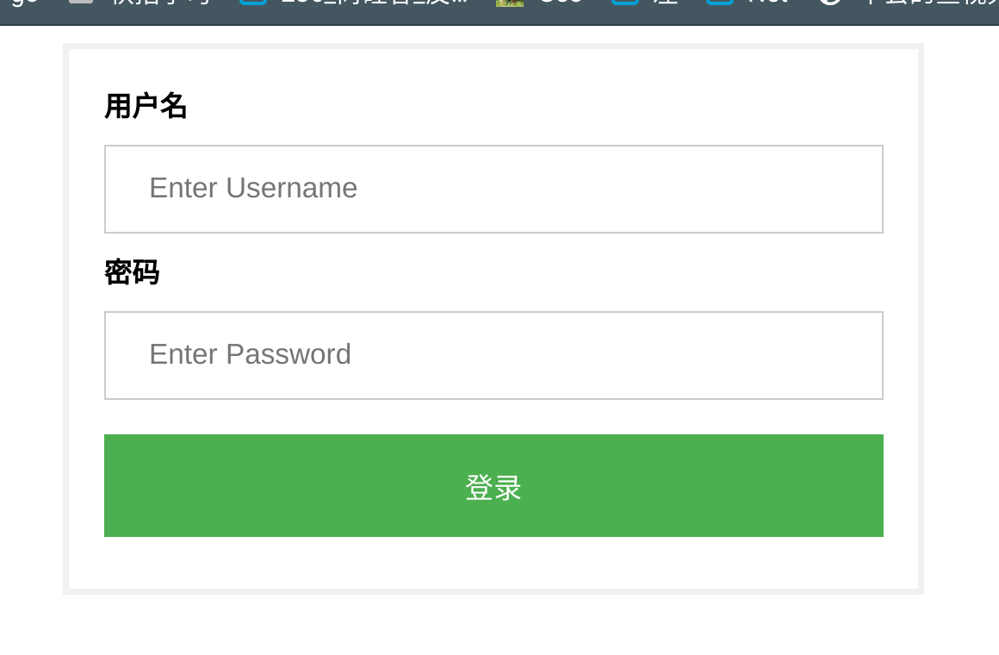
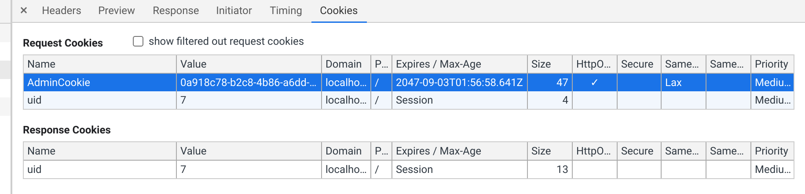

[toc]


# 一、主要重点

### 1. session

- 在用户登录成功之后，**将用户相关的状态填入session**，保存到server中，以便后面商品页面等使用。

1. 创建session

```go
sess := sessions.New(sessions.Config{
		Cookie: "AdminCookie",
	})
```


2. 启动session，注册到Controller中

```go
user.Register(ctx, serviceUser, sess.Start)
```

3. Controller对象中包含一个session对象

```go
type UserController struct {
	Ctx         iris.Context
	Session     *sessions.Session //session对象
}
```

4. 设置session：将需要保存的信息填入到session中

```go
u.Session.Set("userID", strconv.FormatInt(user.ID, 10))
```


### 2. cookie

- 将用户信息保存在cookie客户端中

1. 设置全局cookie

```go
// 设置全局的cookie
func GlobalCookie(ctx iris.Context, name string, value string) {
	ctx.SetCookie(&http.Cookie{Name: name, Value: value, Path: "/"})
}
//在Controller中调用
tool.GlobalCookie(u.Ctx, "uid", strconv.FormatInt(user.ID, 10))
```


### 3. 登录注册的密码验证

- 注册：用户输入密码转换成hashcode后存储在mysql中

  **1. 将明文密码转换成hashcode**

  hashedPassword ： mysql中的hashcode密码

  password ： 没有hash过的密码

  ```go
  func bcrypt.GenerateFromPassword(password []byte, cost int) ([]byte, error)
  ```

  **2. 在本节中的应用例子**

  ```go
  // 将明文密码hash化
  func GeneratePasswd(pwd string) (hashPwd []byte, err error) {
  	return bcrypt.GenerateFromPassword([]byte(pwd), bcrypt.DefaultCost)
  }
  ```

  ```go
  hashpwd, err := GeneratePasswd(user.HashPassword)
  // 插入用户
  user.HashPassword = string(hashpwd)
  ```

  

- 登录：获取密码，将密码转换成hashcode与mysql中的密码对比

  **对比hashcode是否相等的包**

  ```go
  func bcrypt.CompareHashAndPassword(hashedPassword []byte, password []byte) error
  ```

  ​	**在本节中的应用例子**：

  ```go
  user, err = u.UserRepo.Select(userName)
  
  _, err = ValidatePasswd(user.HashPassword, pwd)
  ```

  ​	**包装后的比较hashcode的函数**

  ```go
  func ValidatePasswd(pwd, hashPwd string) (succeed bool, err error) {
  	if err = bcrypt.CompareHashAndPassword([]byte(pwd), []byte(hashPwd)); err != nil {
  		return
  	}
  	return
  }
  ```

  

# 二、代码逻辑

## 1.实现功能：用户登录注册

1. 注册(`/user/register`)成功后跳转到登录页面， 失败进入error(`/user/error`)页面

2. 登录(`/user/login`)成功后进入商品首页(`/product`)
3. 登录失败后重新进入空的登录页面


下面分别是注册、登录页面

 

1. **datamodels**

   - 用户名、用户昵称、密码(hash加密后存储)、ID

2. **repository**：
   - selectByID查找用户
   - insert添加user
     - 将表单填写的密码加密后存入到数据库

3. **service**：

   Service对象需要包含session

   - IsPwdSuccess判断用户输入密码是否正确：
     - 将表单传入密码转换成hash与mysql中密码对比
       - ValidatePassword：bcrypt.CompareHashAndPassword
   - AddUser：添加用户
     - 将表单传入的密码转换成hash之后调用对应repository
       - 转换函数：bcrypt.GenerateFromPassword

4. **Controller**

   controller中包含了session

   - GetRegister:注册页面； GetLogin：登录页面

   - PostRegister： 调用service.addUser

   - PostLogin：调用service.IsPwdSuccess
     - 用户成功登录后将用户信息写入到session里面，放入context
     
       ```go
       tool.GlobalCookie(u.Ctx, "uid", strconv.FormatInt(user.ID, 10))
       u.Session.Set("userID", strconv.FormatInt(user.ID, 10))
       ```
     
       main.go中设置了全局的session
     
       ```go
       // session
       	// session中保存一个cookie的名字
       	sess := sessions.New(sessions.Config{
       		Cookie: "AdminCookie",
       	})
       ```
     
       
     
       

5. **tool**：

   ```go
   //设置全局cookie
   func GlobalCookie(ctx iris.Context, name string, value string) {
   	ctx.SetCookie(&http.Cookie{Name: name, Value: value, Path: "/"})
   }
   ```

6. main.go


## 2. cotroller.go

```go

type UserController struct {
	Ctx         iris.Context
	UserService services.IUserService
	Session     *sessions.Session
}

func (u *UserController) GetRegister() mvc.View {
	return mvc.View{
		Name: "user/register.html",
	}
}

func (u *UserController) PostRegister() {
	// 获取表单内容
	var (
		nickName = u.Ctx.FormValue("NickName")
		userName = u.Ctx.FormValue("UserName")
		passWord = u.Ctx.FormValue("Password")
	)

	// 添加到user表单
	user := &datamodels.User{
		NickName:     nickName,
		UserName:     userName,
		HashPassword: passWord,
	}
	_, err := u.UserService.AddUser(user)
	u.Ctx.Application().Logger().Debug(err) //为什么没有出错也要debug
	if err != nil {
		u.Ctx.Redirect("/user/error")
		return
	}
	u.Ctx.Redirect("/user/login")
	return
}

func (u *UserController) GetLogin() mvc.View {
	return mvc.View{
		Name: "user/login.html",
	}
}

func (u *UserController) PostLogin() mvc.Response {
	// 1. 获取用户表单信息
	var (
		userName = u.Ctx.FormValue("UserName")
		passWd   = u.Ctx.FormValue("Password")
	)
	user, err := u.UserService.IsPwdSucceed(userName, passWd)

	// 2.1 核验结果失败
	if err != nil {
		u.Ctx.Application().Logger().Debug(err)
		return mvc.Response{
			Path: "/user/login",
		}
	}
	// 2.2 密码输入正确:将用户ID写入到cookie中
	tool.GlobalCookie(u.Ctx, "uid", strconv.FormatInt(user.ID, 10))
	u.Session.Set("userID", strconv.FormatInt(user.ID, 10))
	return mvc.Response{
		Path: "/product/",
	}
}
```

