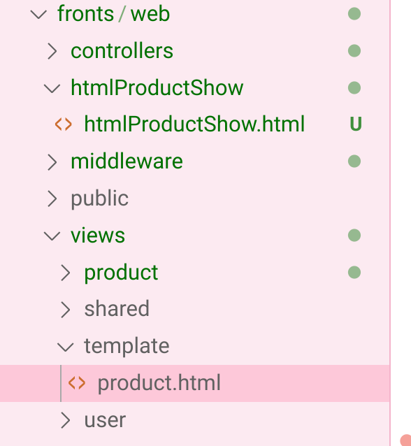

# 一、生成静态文件

## 1. 如何生成静态文件

1. 创建一个controller， 使用 template模板、product(需要渲染到模板中的信息)来生成渲染出一个file = file就是静态文件
2. 将file放在对应文件夹中
3. 用户访问链接，返回文件夹对应的静态文件


## 2. 用户访问

1. **生成静态文件**：访问 "/product/generate/html?productId=?"调用controller，生成静态文件
2. **访问静态文件**：用户访问 "..../html/htmlProductName.html" [这是静态文件的地址], 成功访问获取到静态文件

## 3. 代码实现

### 1.创建静态文件目录

创建文件夹：1.保存静态文件的目录 2.生成静态文件需要的模板对应目录

```go
var (
	// 保存html静态文件的目录
	htmlOutPath = "/home/yang/go/src/Spike-Product-Demo/fronts/web/htmlProductShow"
	// 模板文件目录
	templatePath = "/home/yang/go/src/Spike-Product-Demo/fronts/web/views/template"
)
```



### 2.生成静态文件对应的controller:

- 创建静态文件

- 数据库查询得到数据，渲染到模板，生成静态文件

**生成静态文件**

```go
// 访问创建静态文件
func (c *ProductController) GetGenerateHtml() {
	// 1. 获取html静态文件保存的路径
	fileName := filepath.Join(htmlOutPath, "htmlProductShow.html") //要生成的静态文件的名字
	// 2. 获取template
	contentsTmp, err := template.ParseFiles(filepath.Join(templatePath, "product.html")) // 解析模板，得到模板对象
	if err != nil {
		c.Ctx.Application().Logger().Error(err)
	}
	// 3. 获取Product
	productIDString := c.Ctx.URLParam("productID")
	productID, _ := strconv.Atoi(productIDString)
	product, err := c.ProductService.GetProductByID(int64(productID))
	// 4. 生成静态文件
	generateStaticHtml(c.Ctx, fileName, contentsTmp, product)
}
func generateStaticHtml(ctx iris.Context, fileName string, template *template.Template, product *datamodels.Product) {
	// 1. 判断file是否已经存在：如果存在则要从数据库中查询后重新生成静态文件
	if existFile(fileName) {
		// 存在则删除文件
		err := os.Remove(fileName)
		if err != nil {
			ctx.Application().Logger().Error(err)
		}
	}
	// 2. 生成静态文件：创建文件，将template渲染后输出到文件
	//os.O_WRONLY只写打开,os.O_CREATE如果不存在则创建一个
	file, err := os.OpenFile(fileName, os.O_WRONLY|os.O_CREATE, os.ModePerm)
	if err != nil {
		ctx.Application().Logger().Error(err)
	}
	// 3. 将Product渲染到文件中
	template.Execute(file, &product) //为什么要传入指针地址？因为produc是名字
}

func existFile(fileName string) bool {
	_, err := os.Stat(fileName)
	return err == nil || os.IsExist(err)
}
```


### 3. 注册静态文件路径

```go
app.HandleDir("/html", "./htmlProductShow")
```


## 4. 用户操作

1. 【生成静态文件】用户先访问一个链接`http://localhost:8080/product/generate/html?productID=6`来生成静态文件，server自动将文件保存到目录中：

- 调用controller ： GetGenerateHtml()


2. 【访问静态网页】用户再访问链接`http://localhost:8080/html/htmlProductShow.html`来获取静态文件

- 用户访问/html路径下的文件就会进入./htmlProductShow文件夹`app.HandleDir("/html", "./htmlProductShow")`


