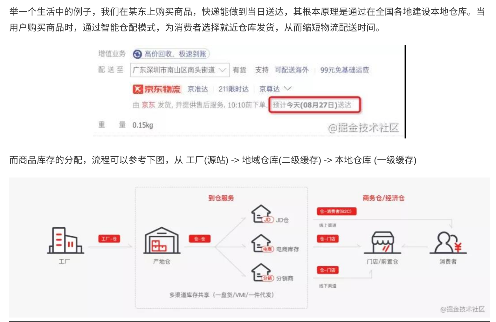
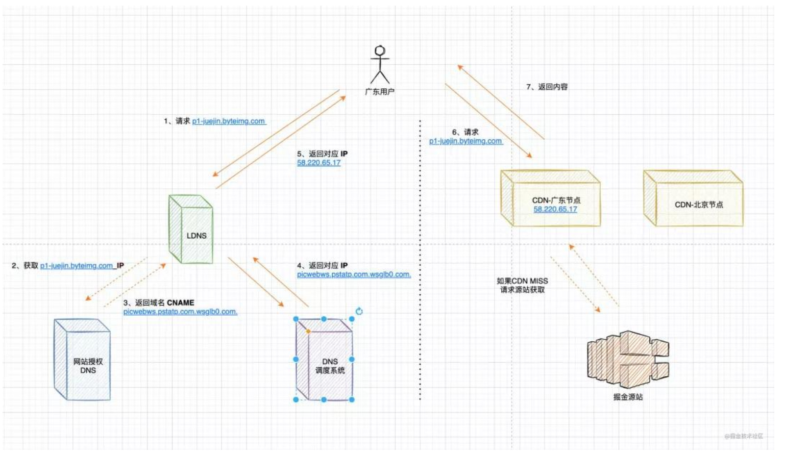

[CDN原理简介](https://www.51cto.com/article/680148.html)

## **CDN原理**：

> 将web资源站点的消息都缓存在CDN的各个节点上，当用户请求命中了某个节点，就可以立刻返回给客户端。
>
> 避免了每个请求都需要请求源站获取，造成网络拥塞

**例子**：京东快递

## CDN访问

1. 用户向LDNS(本地域名解析)请求查询IP地址
2. 如果LDNS没有命中，则向网站授权的DNS进行域名解析
3. 网站授权DNS返回CNAME
4. DNS调度系统返回为用户分配的最佳最近的的IP地址
5. 返回成功解析的IP地址
6. 用向最近的缓存服务器(CND节点)发出请求
7. 最近的节点返回内容到达用户

