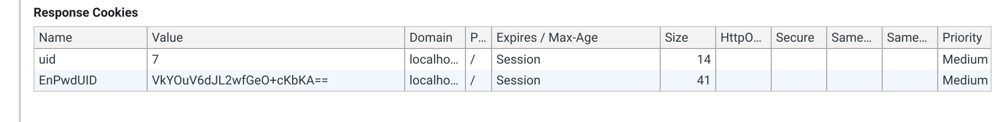

# 一、优化原因

之前使用session存储用户状态信息。

**弊端**：session存储用户信息主要用于中小型项目。因为session是存储在服务器端的，当访问量过大，session数量过多就会非常占用资源。 因此，用户状态信息改在cookie存储。

**实施方法**：

用户信息存储在cookie中。

由于如果内容存储在cookie中在浏览器上，内容容易被篡改，因此有了AES加密算法。

AES对cookie的内容加密存储在cookie上，之后到session中解密使用


# 二、cookie加密实现

- 将UID使用AES加密，加密后写入到cookie里面

```go
uidByte := []byte(strconv.FormatInt(user.ID, 10) // AES加密
uidString, err := encrypt.EnPwdCode(uidByte)
tool.GlobalCookie(u.Ctx, "EnPwdUID", uidString) //存入cookie
```

- 如下，用户第一次访问之后，会返回server存好的cookie给浏览器




# 三、AES加密算法

> 这部分具体怎么实现AES算法没有做

用AES对算法加密

```go
package encrypt

import (
	"bytes"
	"crypto/aes"
	"crypto/cipher"
	"encoding/base64"
	"errors"
)

//高级加密标准（Adevanced Encryption Standard ,AES）

//16,24,32位字符串的话，分别对应AES-128，AES-192，AES-256 加密方法
//key不能泄露
var PwdKey = []byte("DIS**#KKKDJJSKDI")

//PKCS7 填充模式
func PKCS7Padding(ciphertext []byte, blockSize int) []byte {
	padding := blockSize - len(ciphertext)%blockSize
	//Repeat()函数的功能是把切片[]byte{byte(padding)}复制padding个，然后合并成新的字节切片返回
	padtext := bytes.Repeat([]byte{byte(padding)}, padding)
	return append(ciphertext, padtext...)
}

//填充的反向操作，删除填充字符串
func PKCS7UnPadding(origData []byte) ([]byte, error) {
	//获取数据长度
	length := len(origData)
	if length == 0 {
		return nil, errors.New("加密字符串错误！")
	} else {
		//获取填充字符串长度
		unpadding := int(origData[length-1])
		//截取切片，删除填充字节，并且返回明文
		return origData[:(length - unpadding)], nil
	}
}

//实现加密
func AesEcrypt(origData []byte, key []byte) ([]byte, error) {
	//创建加密算法实例
	block, err := aes.NewCipher(key)
	if err != nil {
		return nil, err
	}
	//获取块的大小
	blockSize := block.BlockSize()
	//对数据进行填充，让数据长度满足需求
	origData = PKCS7Padding(origData, blockSize)
	//采用AES加密方法中CBC加密模式
	blocMode := cipher.NewCBCEncrypter(block, key[:blockSize])
	crypted := make([]byte, len(origData))
	//执行加密
	blocMode.CryptBlocks(crypted, origData)
	return crypted, nil
}

//实现解密
func AesDeCrypt(cypted []byte, key []byte) ([]byte, error) {
	//创建加密算法实例
	block, err := aes.NewCipher(key)
	if err != nil {
		return nil, err
	}
	//获取块大小
	blockSize := block.BlockSize()
	//创建加密客户端实例
	blockMode := cipher.NewCBCDecrypter(block, key[:blockSize])
	origData := make([]byte, len(cypted))
	//这个函数也可以用来解密
	blockMode.CryptBlocks(origData, cypted)
	//去除填充字符串
	origData, err = PKCS7UnPadding(origData)
	if err != nil {
		return nil, err
	}
	return origData, err
}

//加密base64
func EnPwdCode(pwd []byte) (string, error) {
	result, err := AesEcrypt(pwd, PwdKey)
	if err != nil {
		return "", err
	}
	return base64.StdEncoding.EncodeToString(result), err
}

//解密
func DePwdCode(pwd string) ([]byte, error) {
	//解密base64字符串
	pwdByte, err := base64.StdEncoding.DecodeString(pwd)
	if err != nil {
		return nil, err
	}
	//执行AES解密
	return AesDeCrypt(pwdByte, PwdKey)
}
```

