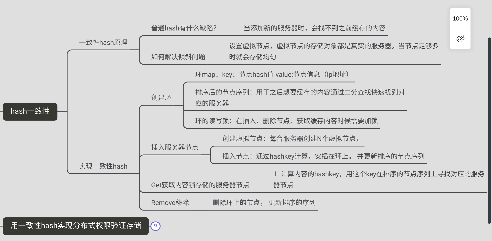
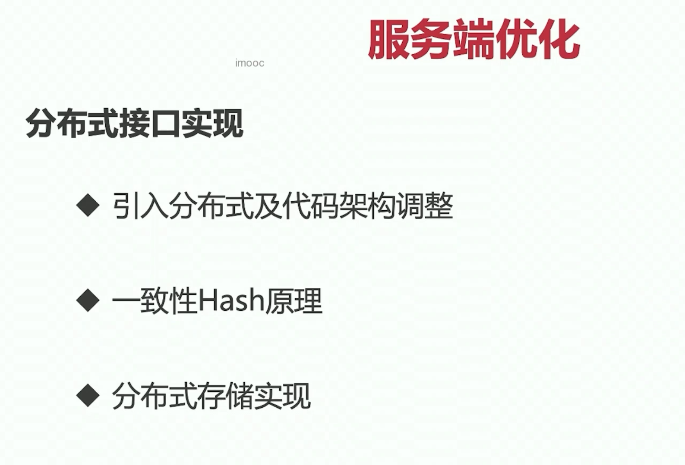
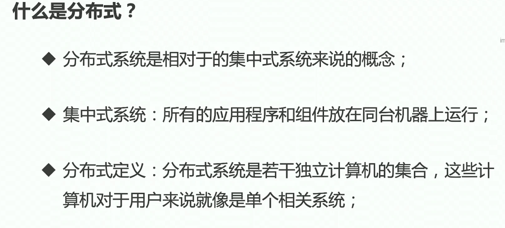
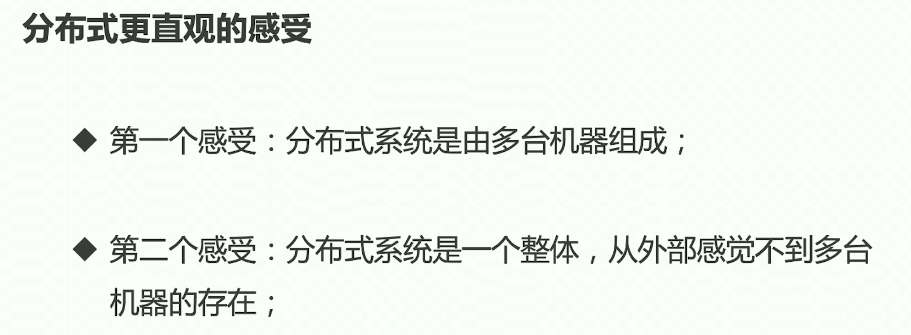
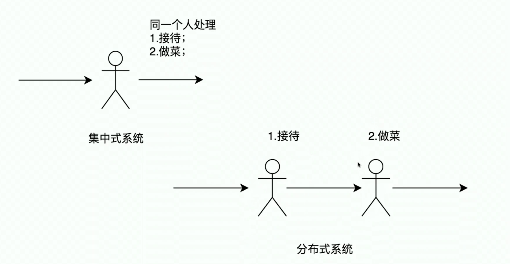
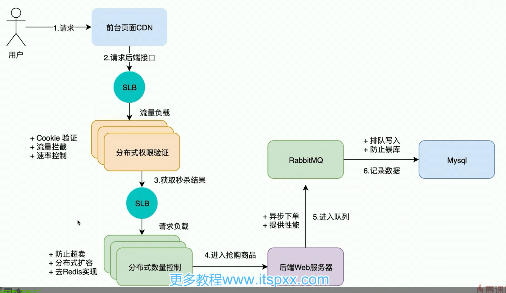

[toc]

# 一、总结:思维导图

# 二、本章主要内容

## 一、分布式与架构调整

### 1. 什么是分布式

- 从外部来看是一个整体
- 从内部去看，是多台机子组成

- 分布式集中式举例子：
    - 同一个人接待、做菜
    - 不同的人接待、做菜

### 2. 秒杀分布式架构

下面的CDN、SLB、RabbitMQ可能是部署在不同的物理机子上的，但各个物理机子之间又通过网络的流程系串联起来了。 

