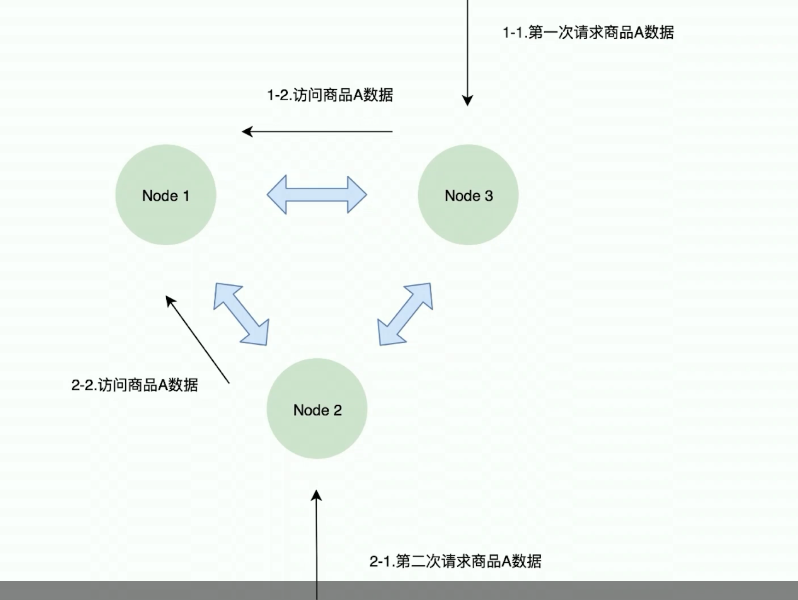

[toc]


- 前面自己要掌握的内容：Redis

# 一、Redis在秒杀系统中的瓶颈

> 瓶颈就是无论是redis的单从还是集群版，都无法解决单个节点(比如一个服务器上存的东西总是被访问)QPS>8W 的情况
>
> 对于高访问量QPS>= 8W , golang的数量控制接口怎么提高QPS的我也不知道。 

## Redis的瓶颈

遇到的问题：

单个商品的QPS >= 8W 时， 即使采用了集群版，仍然性能没有突破

虽然集群能够提高整体的QPS， 但单个节点的QPS没有提高， 因此因为单个商品的性能没有提高，系统上线之后仍然很卡


**单机版**


**集群版**

集群版只是整体的提高的QPS，但没有对单个节点的EQPS提升




# 二、数量控制接口

> 通过go的数量控制接口来提高Redis单个商品的QPS


### 1、 如何保证不会超卖？

Q： 如何保证不会超卖？

A： 保证在秒杀中高并发情况下不会超卖： 互斥锁 (之前hash是读写锁)


### 2、**数量控制接口实现**

- 预存商品数量
- 互斥锁
- 已经秒杀掉的商品数量sum

```go
// - 预存商品数量
var productNum int64 = 10

// - 互斥锁
var mutex sync.Mutex

// - 已经秒杀掉的商品数量sum
var sum int64 = 0
```


- 获取秒杀商品功能函数：

    - 加锁
    - 判断sum是否超过限制


```go
// - 获取秒杀商品功能函数：
func GetOneProduct() bool {
	//   - 加锁
	mutex.Lock()
	defer mutex.Unlock()
	//   - 判断sum是否超过限制
	if sum < productNum {
		sum += 1
		return true
	}
	return false
}
```


- 秒杀商品接口

```go
// - 秒杀商品接口
func GetProduct(rw http.ResponseWriter, req *http.Request) {
	if GetOneProduct() {
		rw.Write([]byte(strconv.Itoa(int(sum)) + " true"))
		return
	}
	rw.Write([]byte("false"))
	return
}
```


### 3、测试结果

**测试结果**

```bash
~ go run getOne.go
```

访问 `http://localhost:8080/getOne`


**全部代码**

```go
package main

import (
	"log"
	"net/http"
	"strconv"
	"sync"
)

// 防止超卖

// - 预存商品数量
var productNum int64 = 10

// - 互斥锁
var mutex sync.Mutex

// - 已经秒杀掉的商品数量sum
var sum int64 = 0

// - 获取秒杀商品功能函数：
func GetOneProduct() bool {
	//   - 加锁
	mutex.Lock()
	defer mutex.Unlock()
	//   - 判断sum是否超过限制
	if sum < productNum {
		sum += 1
		return true
	}
	return false
}

// - 秒杀商品接口
func GetProduct(rw http.ResponseWriter, req *http.Request) {
	if GetOneProduct() {
		rw.Write([]byte(strconv.Itoa(int(sum)) + " true"))
		return
	}
	rw.Write([]byte("false"))
	return
}

func main() {
	http.HandleFunc("/getOne", GetProduct)
	if err := http.ListenAndServe(":8080", nil); err != nil {
		log.Fatal("Err:", err)
	}
}

```

