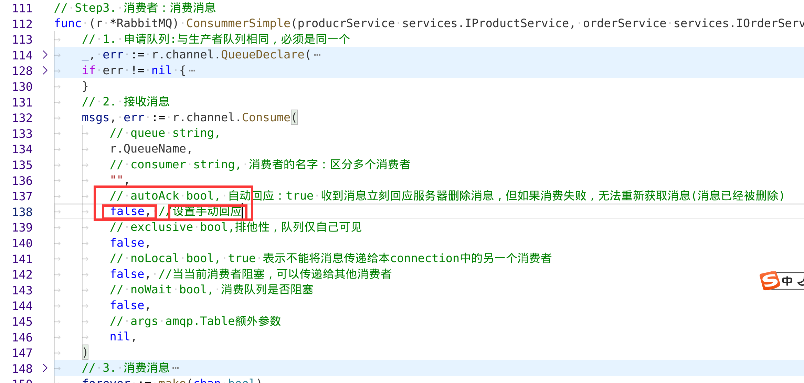
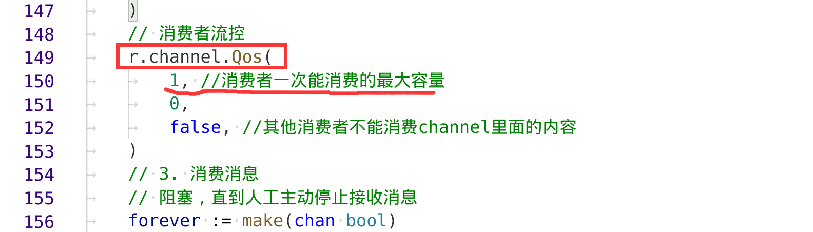
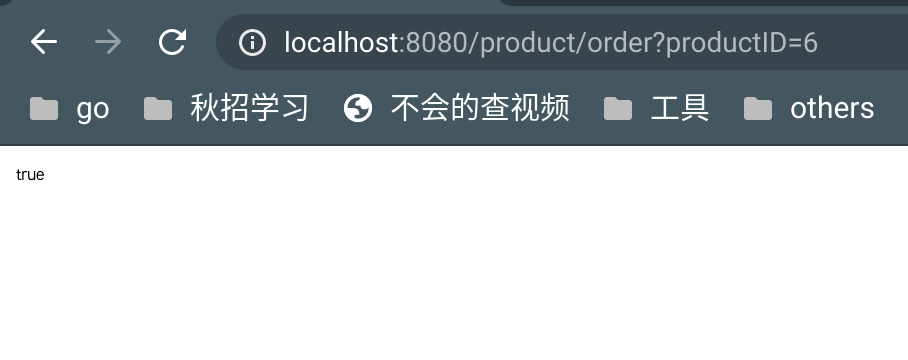
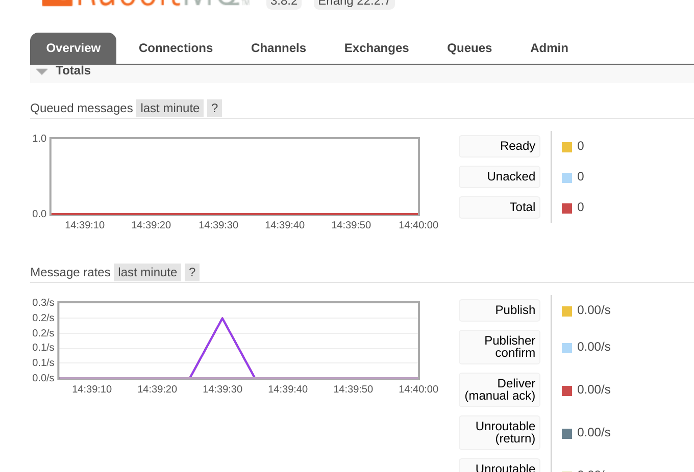
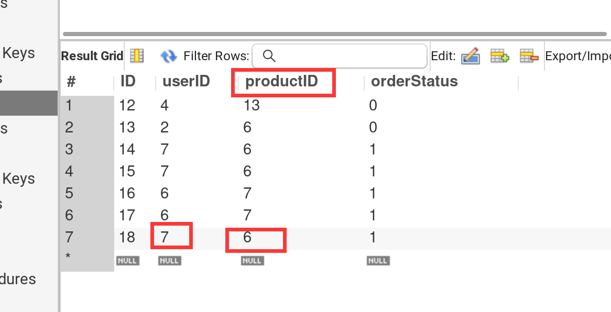

[toc]


> **重点**
>
> - 保证消费端一个一个的message消费
>
>   在rabbitMQ 中设置
>
> - 在consummer.go消费端写入逻辑


# 一、实现consumer消费端

**实现步骤**

1. 创建consummer.go文件
2.  链接数据库
3. 创建SimpleConsumer
4. 设置消费方式：一个一个消费
5. 添加Simpleconsumer逻辑代码：减少Product数量、增加订单


#### 1. 创建consummer.go文件

**创建文件**

- **链接数据库**

- **创建SimpleConsumer**
- 在根目录下创建`consumer.go`：因为需要部署从consumer

```go
func main() {

	// =============== 1.链接数据库 ==============
	// 因为要单独部署，因此需要链接数据库

	db, err := common.NewMysqlConn()
	if err != nil {
		log.Fatalln("consumer 链接数据库错误， Error：", err)
	}

	// =================2. 创建simpleConsummer： 创建order product的操作实例===========
	productRepository := repository.NewProductManager("product", db)
	productService := services.NewIPoductSeviceManager(productRepository)
	orderRepository := repository.NewOrderManagerRepo("spikeSystem.order", db)
	orderService := services.NewOrderServiceManager(orderRepository)
	rabbitConsumSimple := rabbitmq.NewRabbitMQsimple("spikeProduct") //名字与生产端对齐
	// 消费消息
	rabbitConsumSimple.ConsummerSimple(productService, orderService)
}
```


#### 2. 【核心】设置消费方式：一个一个消费

**如何实现消费一个，通知生产端生产一个防止堵塞？**

- 设置消费端为手动回应： autoACK = false
- 设置QOS：消费者流速控制





```go
// 2. 接收消息
	msgs, err := r.channel.Consume(
		// queue string,
		r.QueueName,
		// consumer string, 消费者的名字：区分多个消费者
		"",
		// autoAck bool, 自动回应：true 收到消息立刻回应服务器删除消息，但如果消费失败，无法重新获取消息(消息已经被删除)
		false, //设置手动回应
		// exclusive bool,排他性，队列仅自己可见
		false,
		// noLocal bool, true 表示不能将消息传递给本connection中的另一个消费者
		false, //当当前消费者阻塞，可以传递给其他消费者
		// noWait bool, 消费队列是否阻塞
		false,
		// args amqp.Table额外参数
		nil,
	)
	// 消费者流控
	r.channel.Qos(
		1, //消费者一次能消费的最大容量
		0,
		false, //其他消费者不能消费channel里面的内容
	)
```


#### 3. 添加SimpleConsumer逻辑代码：减少Product数量、增加订单    

- 在消费端添加处理逻辑代码：

  1. 获取message中的消息体
  2. 用productID在mysql中查询到product
  3. product数量-1
  4. 创建order插入倒数据库

  5. 通知生产端已经消费完毕

  

  ```go
  	go func() {
  		for msg := range msgs {
  			// 处理消息:逻辑代码自行添加
  			log.Printf("Recive a message:%s", msg.Body)
  			// 接收消息
  			message := &datamodels.Message{}
  			err := json.Unmarshal([]byte(msg.Body), message) //接收消息，解析到message里面
  			if err != nil {
  				log.Fatalln("接收消息出错：Error：", err)
  			}
  			// 减少productNum
  			err = productService.SubProductNum(message.ProductID)
  			if err != nil {
  				log.Fatalln("consumer.go商品数量减少出错：Error：", err)
  			}
  			// 插入订单
  			err = orderService.InsertOrderByMessage(message)
  			if err != nil {
  				log.Fatalln("consumer.go创建订单出错：Error：", err)
  			}
  			// 通知完成
  			//如果为true表示确认所有未确认的消息，
  			//为false表示确认当前消息
  			msg.Ack(false)
  		}
  	}()
  ```

  

# 二、测试

1. 运行consumer.go
2. 访问 “:8080/product/order” 抢购，抢购多次
3. 查看rabbitMQ管理界面是否有消息在生产and消费
4. 查看mysql中数据变化


1. 运行consumer.go

   ```bash
    go run consumer.go
   数据库链接成功
   2022/11/10 14:38:17 [*]Waiting for message， To Exit by ctrl+Enter
   ```

2. 访问 “:8080/product/order?productID=6” 抢购，抢购多次

   //抢购ID=6的商品

   

3. 查看rabbitMQ管理界面是否有消息在生产and消费

   生产端产生的消息，消费端及时消费了

   

4. 查看mysql中数据变化

下面是成功创建的订单



​                                                                                                                                                      

