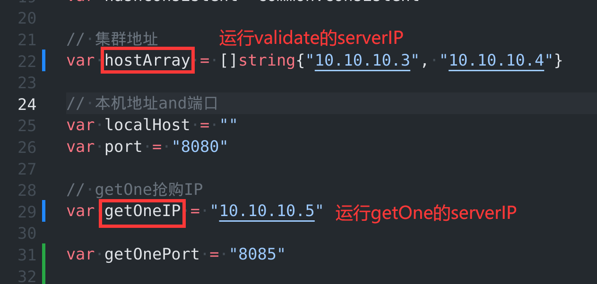
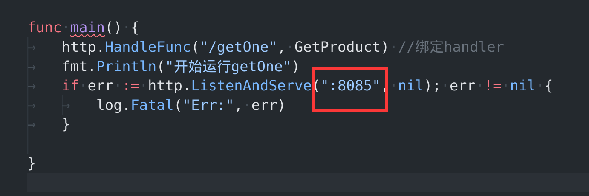

[toc]


# 一、蓝图

1. 创建多台虚拟机

2. 2台用于运行validate.go 过滤用户请求

   1台用于getOne控制商品数量

   1台用于运行RabbitMQ控制对数据库的访问

3. 将`validate.go`  `getOne.go`生成可执行文件，分别在不同的server上运行

4. 在任意一台机子上访问 `http://validateServerIP:8080/check?productID=6` 并带上cookie

|      | IP地址       | 运行内容    |
| ---- | ------------ | ----------- |
|      | 10.10.10.3   | validate.go |
|      | 10.10.10.4   | validate.go |
|      | 10.10.10.5   | getOne.go   |
|      | 10.10.10.128 | RabbitMQ    |


# 二、创建虚拟机集群

- 创建4台虚拟机，其中一台需要安装RabbitMQ

  [创建虚拟机方法](https://github.com/bigrainking/LinuxNote/blob/master/%E5%AE%89%E8%A3%85%E8%99%9A%E6%8B%9F%E6%9C%BAVMWare.md)

  安装好虚拟机后克隆几台

- 虚拟机安装Ubuntu Server ： 只需要作为服务器

- 设置NAT模式让主机和四台虚拟机可以相互Ping通

  [多台虚拟机相互通信](https://github.com/bigrainking/LinuxNote/blob/master/%E5%A4%9A%E5%8F%B0%E8%99%9A%E6%8B%9F%E6%9C%BA%E7%9B%B8%E4%BA%92%E9%80%9A%E4%BF%A1.md)


# 三、配置集群等

> 在validate.go中需要填写每台服务器的地址，来创建哈希环。
>
> 1. 设置服务器地址
> 2. 设置getOne地址


1. 在validate.go中，填入IP地址，以及自己写对应端口




2. 在 `getOne.go` 中对应的修改端口号

   

# 四、RabbitMQ远程访问

1. RabbitMQ如果要在其他服务器上连接访问，不能使用guest用户，需要创建新的administrator类型的用户。

   （注意在新用户下面需要创建一个新的VirtualHost，）

2. 在 `rabbitmq.go` 的连接语句改为， 最后的rabbitVHost是创建的test用户的VirtualHost。  `test:1` 对应的是用户名:密码

   `const MQURL = "amqp://test:1@10.10.10.128:5672/rabbitVHost"`

[具体创建用户方法见点击 ](../03认识RabbitMQ/2新建用户远程访问.md)

# 五、部署运行

> 1. 每台机器上运行可执行文件
> 2. 访问时需要加上cookie （从之前的frontMain.go运行时，用户登陆成功后生成的cookie）


#### 1. 运行可执行文件

1. go build validate.go 生成的可执行文件 `valiadate` ，直接在虚拟机上通过 `./Validate`即可运行， 不需要将整个项目搬迁到虚拟机上。

2. 可执行文件如果无法运行需要 `chmod +x valiadate` 来添加执行权限

#### 2. 访问抢购

1. 集群中任意一台机器访问 `curl -b "uid=xxx;signuid=xxxxxx" http://{validate运行的server对应的IP}:port/check?productID=6`

   其中 `-b "uid=xxx;signuid=xxxxxx" ` 表示有2个cookie， 分别是明文的UID和加密后的userID

# 六、遇到问题

打开虚拟机防火墙，并且打开每台虚拟机运行的 .`.go` 文件对应的端口 （具体打开方法见本目录下[另一个文件](../问题-外部无法访问server.md)）


# 七、源码

#### **validate.go**

```go
package main

import (
	"Spike-Product-Demo/common"
	"Spike-Product-Demo/datamodels"
	"Spike-Product-Demo/encrypt"
	"Spike-Product-Demo/rabbitmq"
	"encoding/json"
	"errors"
	"fmt"
	"io/ioutil"
	"net/http"
	"net/url"
	"strconv"
	"sync"
)

// 全局统一一致性hash环
var hashConsistent *common.Consistent

// 集群地址
var hostArray = []string{"10.10.10.3", "10.10.10.4"}

// 本机地址and端口
var localHost = ""
var port = "8080"

// getOne抢购IP
var getOneIP = "10.10.10.5"

var getOnePort = "8085"

// RabbitMQ
var rabbitMQValidate *rabbitmq.RabbitMQ

// 用户权限验证
var accessControl = &AccessControl{sourcesArray: make(map[int]interface{})}

// 【AccessControl】存储用户想要存储的信息
type AccessControl struct {
	sourcesArray map[int]interface{} //key:UID  value:用户想要存储的信息
	sync.RWMutex
}

// 统一验证拦截器，每个借口都需要提前验证
func Auth(rw http.ResponseWriter, req *http.Request) error {
	fmt.Println("执行拦截器!")
	// 添加身份验证函数
	err := CheckUserInfo(req)
	if err != nil {
		fmt.Println(err)
		return err
	}
	return nil
}

// 验证用户UID是否被篡改
func CheckUserInfo(r *http.Request) error {
	// 获取用户uid
	uidCookie, err := r.Cookie("uid")
	if err != nil {
		return errors.New("用户uid获取失败")
	}
	// 获取加密后的uid
	signCookie, err := r.Cookie("signuid")
	if err != nil {
		return errors.New("加密后的uid获取失败")
	}
	// 解密加密后的uid
	signByte, err := encrypt.DePwdCode(signCookie.Value)
	if err != nil {
		return errors.New("加密信息被篡改")
	}
	// fmt.Println("结果比对")
	// fmt.Println("用户ID：" + uidCookie.Value)
	// fmt.Println("解密后用户ID：" + string(signByte))
	// 对比解密后的uid与明文uid
	if CheckInfo(uidCookie.Value, string(signByte)) {
		return nil
	}
	return errors.New("身份校验失败！")
	// return nil
}

func CheckInfo(checkStr, signStr string) bool {
	if checkStr == signStr {
		return true
	}
	return false
}

// 【用户权限验证】正常注册的handler
func CheckRight(w http.ResponseWriter, r *http.Request) {
	right := accessControl.GetDistributedRight(r) //验证的是模拟的请求，此时就是本机:Get Map
	if !right {
		w.Write([]byte("false"))
		return
	}
	w.Write([]byte("true"))
	return
}

// 注册在/check下面的handler， CheckUserInfo拦截器完成后就进入这个function
func Check(rw http.ResponseWriter, req *http.Request) {
	fmt.Println("执行check：正常注册函数！")
	// return errors.New("验证错误！")
	// 这里添加正常业务逻辑函数： 秒杀商品内容

	// 0.获取用户ID productID
	queryForm, err := url.ParseQuery(req.URL.RawQuery)
	// 出错的条件应该是只要有一个错了就错了
	if err != nil || len(queryForm["productID"]) <= 0 || len(queryForm["productID"][0]) <= 0 {
		rw.Write([]byte("productID不存在， err:" + err.Error()))
		return
	}
	productString := queryForm["productID"][0]
	userCookie, err := req.Cookie("uid") // 从cookie中获取UID
	if err != nil {
		rw.Write([]byte("用户ID不存在， err:" + err.Error()))
		return
	}
	fmt.Println("用户名，商品名：", userCookie.Value, productString)
	// 1. 用户权限验证
	right := accessControl.GetDistributedRight(req) //验证的是req
	if right == false {
		rw.Write([]byte("用户" + userCookie.Value + "没有权限"))
		return
	}
	// 2. 抢购数量限制
	hostUrl := "http://" + getOneIP + ":" + getOnePort + "/getOne"
	responseValidate, bodyValidate, err := GetCurl(hostUrl, req) //获取权限map中存储的user权限true
	if err != nil {
		rw.Write([]byte("请求抢购出错"))
	}

	// 判断是否抢购成功， 抢购成功了则可以下单调用getOrder在RabbitMQ里面排队
	if responseValidate.StatusCode == 200 {
		fmt.Println(string(bodyValidate))
		if string(bodyValidate) == "true" {
			// 这里的bodyValidate是getOne.go中网页写的返回值：rw.Write([]byte("true"))
			// 整合下单
			// 1. 获取ID
			productID, _ := strconv.ParseInt(productString, 10, 64)
			userID, _ := strconv.ParseInt(userCookie.Value, 10, 64)
			// 2. 创建消息体
			message := datamodels.NewMessage(productID, userID)
			messageByte, _ := json.Marshal(message)
			// 3. 生产消息
			err = rabbitMQValidate.PublishSimple(string(messageByte))
			if err != nil {
				rw.Write([]byte("false"))
				return
			}

			rw.Write([]byte("true:恭喜你抢购成功正在创建订单，请等待"))
			return
		}
	}
	rw.Write([]byte("对不起，你没抢到！....."))
	return
}

// 【GetNewRecord】根据UID获取用户指定信息
// 功能函数，直接通过UID获取信息，没有逻辑判断
func (a *AccessControl) GetNewRecord(uid int) interface{} {
	// 操作AccessControl需要加读写锁
	a.RWMutex.Lock()
	defer a.RWMutex.Unlock()
	// 此处的用户存储信息是该用户是否有权限
	return a.sourcesArray[uid]
}

// 【SetNewRecord】根据UID设置用户信息
func (a *AccessControl) SetNewRecord(uid int, data interface{}) {
	// 操作AccessControl需要加读写锁
	a.RWMutex.Lock()
	defer a.RWMutex.Unlock()
	data = "你好肥猪"
	a.sourcesArray[uid] = data
}

// 获取用户权限
func (a *AccessControl) GetDistributedRight(req *http.Request) bool {
	// 1. 获取cookie uid
	uid, err := req.Cookie("uid")
	if err != nil {
		return false
	}
	// 2. 根据用户uid获取具体服务器
	// fmt.Println("根据用户uid获取具体服务器:", uid.Value)
	hostRequest, err := hashConsistent.Get(uid.Value)
	// fmt.Println("hostRequest:", hostRequest)
	if err != nil {
		fmt.Println("用户获取对应的服务器失败")
		return false
	}
	// 3. 判断是否为本机，再获取uid对应内容
	// fmt.Println("获取到的本机IP：", localHost)
	if hostRequest == localHost {
		return a.GetDataFromMap(uid.Value)
	} else {
		// 查找在哪台服务器
		// 去那台服务器上找
		return a.GetDataFromOtherMap(hostRequest, req)
	}
}

// 【GetDataFromMap】本机获取操作变量:????为什么只返回bool？？？
// 获取用户权限
func (a *AccessControl) GetDataFromMap(uid string) bool {
	// 获取uid对应信息
	uidInt, err := strconv.Atoi(uid)
	if err != nil {
		return false
	}
	data := a.GetNewRecord(uidInt)
	// 逻辑判断：以后可以扩充逻辑
	// UID存储的是，用户是否有权限，有权限则返回true，否则返回没有
	if data != nil {
		return true
	}
	return false
}

// 【GetDataFromOtherMap】模拟机器通过代理获取其他机器变量
func (a *AccessControl) GetDataFromOtherMap(host string, request *http.Request) bool {
	// ==模拟一台客户端访问==

	// 构造请求
	hosturl := "http://" + host + ":" + port + "/checkRight" //不能请求Check，否则进入死循环
	response, body, err := GetCurl(hosturl, request)
	if err != nil {
		return false
	}

	// 判断返回状态
	if response.StatusCode == 200 {
		if string(body) == "true" { //
			return true
		} else {
			return false
		}
	}
	return false
}

// 模拟HTTP请求
func GetCurl(hosturl string, request *http.Request) (response *http.Response, body []byte, err error) {
	// 模拟client
	client := &http.Client{}
	// 创建cookie
	uid, err := request.Cookie("uid")
	if err != nil {
		return
	}
	signuid, err := request.Cookie("signuid")
	uidCookie := &http.Cookie{Name: "uid", Value: uid.Value, Path: "/"}
	signCookie := &http.Cookie{Name: "signuid", Value: signuid.Value, Path: "/"}
	// 构造请求
	req, err := http.NewRequest("Get", hosturl, nil)
	if err != nil {
		return
	}
	req.AddCookie(uidCookie)
	req.AddCookie(signCookie)
	// 模拟访问,获取返回信息
	response, err = client.Do(req)
	defer response.Body.Close()
	if err != nil {
		return
	}
	body, err = ioutil.ReadAll(response.Body)
	if err != nil {
		return
	}
	return
}

func main() {
	// 负载均衡设置
	// - 采用hash一致性算法
	hashConsistent = common.NewConsistent()
	// - 添加节点
	for _, ip := range hostArray {
		hashConsistent.Add(ip)
	}

	//获取本机IP
	LocalIP, err := common.GetIntranceIP()
	if err != nil {
		fmt.Println("获取本机IP地址错误， ERROR ： ", err) //出错后不终止运行
	}
	localHost = LocalIP
	fmt.Println(localHost)

	// 创建rabbitMQ
	rabbitMQValidate = rabbitmq.NewRabbitMQsimple("spikeProduct")
	defer rabbitMQValidate.Destory()

	// 临时添加UID权限
	accessControl.sourcesArray[7] = true
	fmt.Println(accessControl.sourcesArray)

	// 1. 创建拦截器
	filter := common.NewFilter()
	// 2. 注册运行拦截器
	filter.RegisteFilter("/check", Auth)
	filter.RegisteFilter("/checkRight", Auth)
	// 3. 注册函数
	http.HandleFunc("/check", filter.Handle(Check))
	http.HandleFunc("/checkRight", filter.Handle(CheckRight))
	// 4. 启动
	http.ListenAndServe(":8080", nil) //本机端口

}
```


#### **getOne.go**

```go
package main

import (
	"fmt"
	"log"
	"net/http"
	"sync"
)

// 防止超卖

// - 预存商品数量
var productNum int64 = 10000

// - 互斥锁
var mutex sync.Mutex

// - 已经秒杀掉的商品数量sum
var sum int64 = 0

// - 获取秒杀商品功能函数：
func GetOneProduct() bool {
	//   - 加锁
	mutex.Lock()
	defer mutex.Unlock()

	//   - 判断sum是否超过限制
	if sum < productNum {
		sum += 1
		fmt.Println(sum)
		return true
	}
	return false
}

// - 秒杀商品接口
func GetProduct(rw http.ResponseWriter, req *http.Request) {
	// 获取商品数量

	if GetOneProduct() {
		rw.Write([]byte("true"))
		return
	}
	rw.Write([]byte("false"))
	return
}

func main() {
	http.HandleFunc("/getOne", GetProduct) //绑定handler
	fmt.Println("开始运行getOne")
	if err := http.ListenAndServe(":8085", nil); err != nil {
		log.Fatal("Err:", err)
	}

}
```

