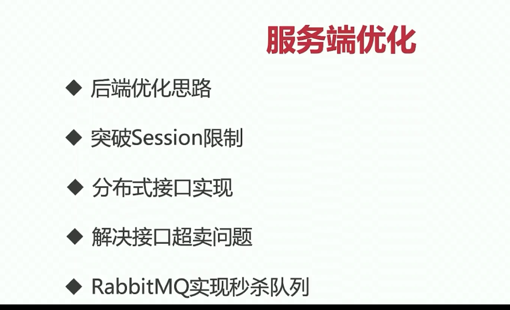
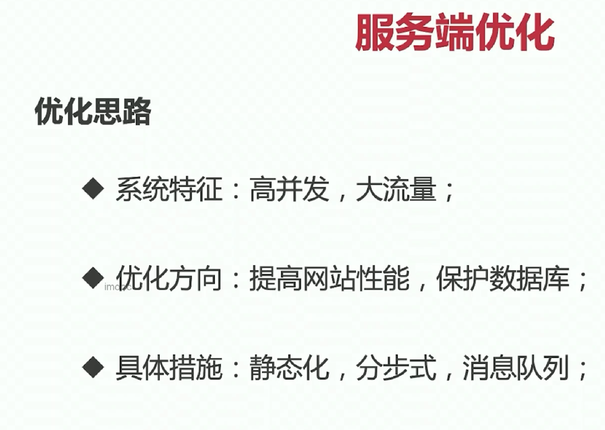
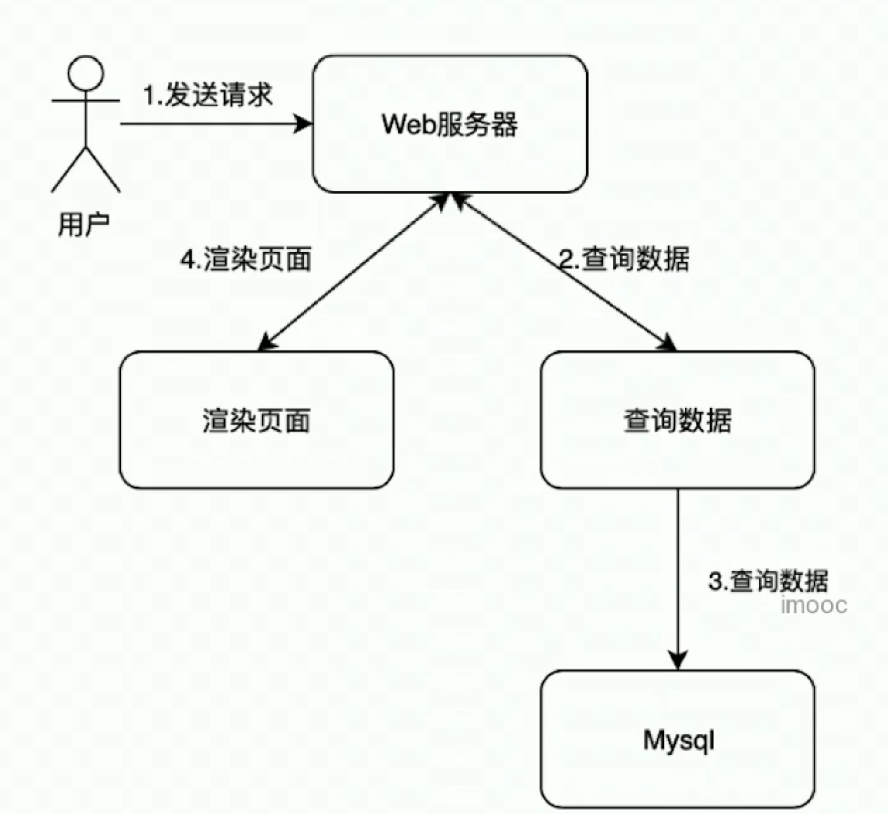
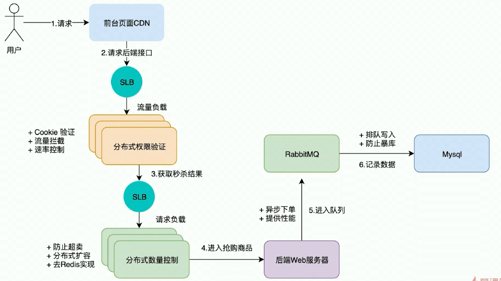

# 优化思路

### 1. 优化思路

优化方向：

- 保护数据库，数据库的访问量很大

具体措施：

- 静态化：前端静态化
- 分布式：后端； 提高网站的运行性能
- 消息队列：保护数据库，进入数据库的请求都需要在队列排队

### 2. 系统架构

**优化前的架构** 

每个请求都可以查询数据库

**优化的架构**

SLB：流量负载均衡器

- 分布式权限验证： 横向的可扩展

    - 当通过了权限验证，就可以请求秒杀
    - 权限验证是横向的可扩展多个验证内容： cookie验证、流量拦截（当请求过多）、速率控制（）

- 分布式数量控制

    