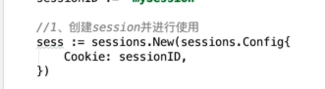
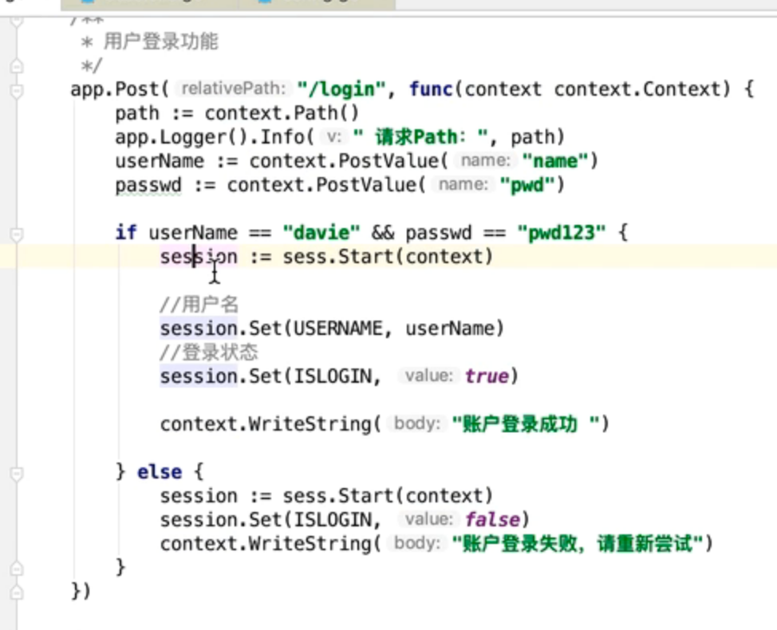
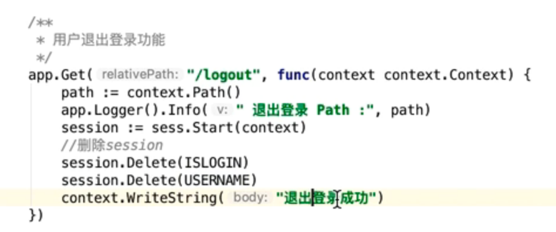
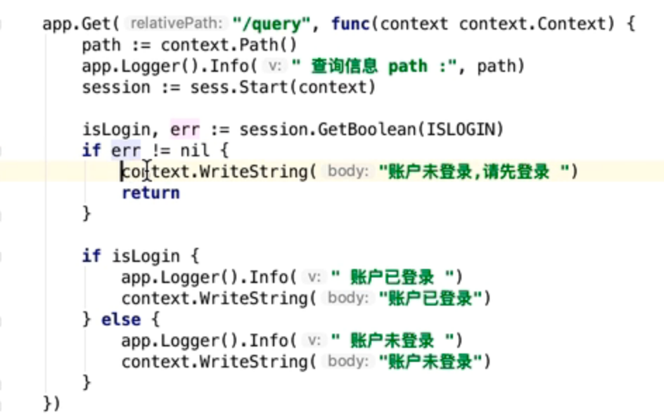
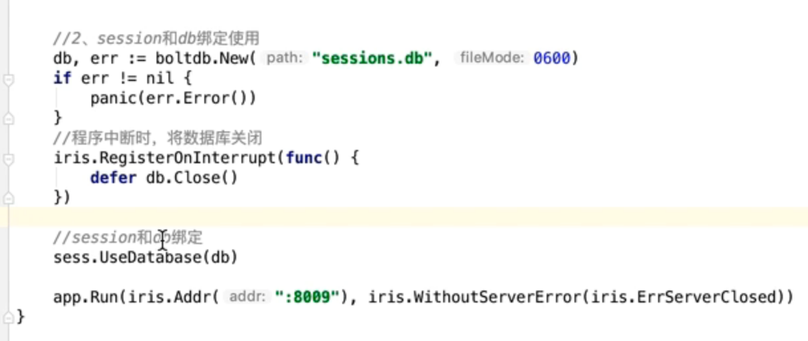

> session在iris框架中的体现

[session的理论介绍](https://www.cnblogs.com/wenxuehai/p/12061301.html#autoid-h2-0-0-0)

[B站前锋教育视频](https://www.bilibili.com/video/BV1UT4y137dS?p=7&vd_source=47272764e1eb400edc65776bfe6a48af)


# 一、Session的使用与控制

session在iris框架中是存储在/iris/sessions包中的

## 1. session与cookie的区别

- 相同点：

  都是为了保存客户端相关信息，在客户登录、注册等操作之后能保存客户端状态信息，以便后面的继续跟踪开发

- 不同点：

  - 保存位置：cookie保存在客户端，方便客户端请求使用； session保存在服务器端，方便服务器存储客户端的连接状态
  - 存储数据类型不同：cookie存储string类型，session存储int、bool等多种类型

  

## 2. session的使用

### 2.1 session的创建与获取session信息

1. 创建session

   ```go
   sessions.New(sessions.Config{...})
   返回的是一个sessions
   ```

   



2. 设置session

   ```go
   session := sess.Start(context) //开启session
   session.Set(变量名，value) //设置变量对应的值
   ```

   




3. 删除session存储的信息：退出登录，删除session存储的用户信息

   ```go
   session.Delete()
   ```

   

   

4. 获取session存储的值

   ```go
   session.GetBoolean(变量名) 获取bool类型值
   ```

   


### 2.2 session与数据库绑定使用

> 当服务器端需要
>
> 重启时，server之前存储的session会话信息就需要转存到另一个地方，以防止丢失。
>
> - **解决办法**：将session存储在数据库中

boltdb是类似于redis的键值对数据库

```go
sess.UseDatabase(databaseName)将session数据存储在数据库中
```




【天将降大任于斯人也，必先苦其心志，劳其筋骨，饿其体肤，空乏其身，行拂乱其所为。所以动心忍心，增益其所不能】


