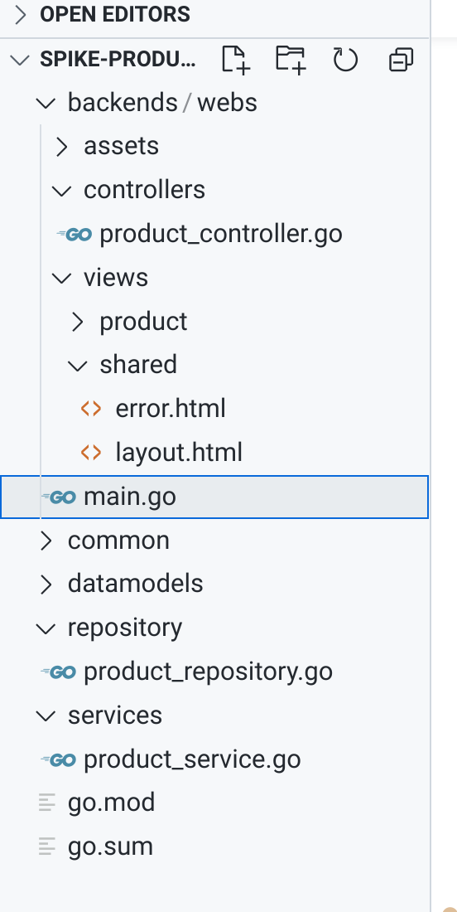

### 1.创建go.mod文件: 

在根目录下执行 `go mod init` 就会生成go.mod文件



你看上面main.go文件不在根目录下，go.mod文件在

### 2. 在某个文件下面需要引入一个的包的下载方法：

1. 直接在文件中import这个包

   ```go
   import (
   	"github.com/kataras/iris/v12"
   	"github.com/kataras/iris/v12/mvc"
   )
   ```

2. 在`go.mod`文件中require这个包

   ```go
   require (
   	github.com/go-sql-driver/mysql v1.6.0
   	github.com/kataras/iris/v12 v12.1.8
   )
   ```

3. 同时在根目录下执行 `go mod tidy`