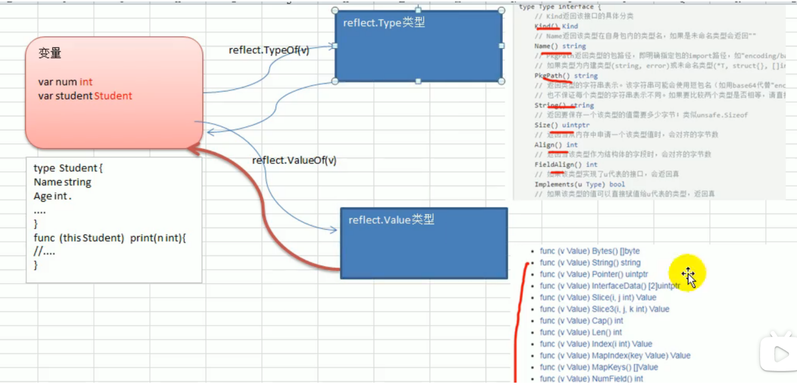

[toc]


# 一、反射的基本概念

## （一）什么是反射？

- **运行时**（而不是编译）可以动态的获取变量的信息，如变量的类型Type、类型Kind
- 对于结构体变量，可以获取到结构体的字段、Tag、调用结构体对应方法
- 反射可以修改变量的值SetXxx
- 使用反射 import "reflect"


## （二）反射的应用场景？

1. 定义一个适配器作为函数的统一处理接口, 实现多个函数用同一个入口进入调用

   

2. 获取结构体的Tag标签


## （三）基本介绍and重要函数？

- reflect.ValueOf(b interface)
- reflect.TypeOf()
- Kind()
- Field()\NumField()
- Elem()
- SetInt()\SetXxx()


### 1）reflect.Value & reflect.Type 类型

- reflect.Value & reflect.Type 是两个反射的结构体类型

  这两个类型分别实现了很多的方法，当某个变量转换成这两个类型，就可使用反射的很多方法

  比如 

  type Type interface{

  ​	Kind() Kind

  ​	....

  }

- `reflect.ValueOf(变量名)` 返回变量对应的**reflect.Value**类型

- `reflect.TypeOf(变量名)` 返回变量对应的reflect.Type类型

  


### 2）Kind：类别 

**1）** **Kind是变量的类别**，本质上kind是一个常量

- 比如`type Student struct{}` ：Student是一个类型， struct就是他的类别。

  ```go
  const (
      Invalid Kind = iota
      Bool
      Int
      Int8
      Int16
      Int32
      Int64
      Uint
      Uint8
      Uint16
      Uint32
      ....
  ```

​	[具体的类别在官方文档中是const常量：Kind](https://studygolang.com/static/pkgdoc/pkg/reflect.htm#Kind)


**2）** **kind与Type可能是相同or可能是不同的**

- 当**变量是基本类型时相同**：var num int = 100 ： kind = type = int

- 当变量是结构体or其他时候：var stu Student : kind=`struct`(结构体), type=`Student`(结构体名)

  

**3）获取类别的方法：**

- `(Value or Type).Kind(变量名) Kind`返回变量的Kind类别
- 通过reflect.Type  reflect.Value来获取都是一样可以获取到

```go
func testReflect02(b interface{}) {
	rType := reflect.TypeOf(b)
	rVal := reflect.ValueOf(b)

	// 3. 获取变量对应的kind
	kind1 := rType.Kind()
	kind2 := rVal.Kind()
	fmt.Printf("kind1=%v, kind2=%v\n", kind1, kind2)//kind1=struct, kind2=struct
```


### 3）Field() 字段值

- NumField()：返回对应的结构体有几个字段

- (reflect.Value).Field(i int) 返回结构体变量的第i个字段值

  ```go
  type Stu struct{
      Name string
      Age int
  }
  student := Stu{"zhangsan", 99}
  val := reflect.ValueOf(student)
  val.Field(0) ： 返回"张三" student第一个字段Name的值
  val.Field(1) : 返回99  student第二个字段Age的值
  
  val.NumField() == 2 ：这个结构体一共有2个字段(即使只赋值了1个字段)
  ```

  

### 4）Elem()

Elem()相当于什么？

1. **Elem()用来干什么？**

​	如果要进行反射的是一个指针变量，那么 reflect.ValueOf(变量名)以及TypeOf都会返回变量指针对应的地址。

​	那么 ().Kind() 将得到地址对应的类别

​	().Field(i) 将无法获取到字段值

​	().SetXxx() 改变值时会panic

​	**因此对于指针变量，需要用Elem()来获取指针对应的值**

2. **如何使用Elem()？**

   在调用Kind()、Field()之前调用Elem()就可以了，调用了Elem()之后使用和非指针变量方式一样 

   ```go
   reflect.ValueOf(&变量名).Elem().Kind()
   ```

3.Elem()相当于获取指针的值 & *的方式


### 5）(reflect.Value).SetXxx()设置值

1. **func (v Value).SetInt(新的值 int64)**的作用

   改变旧的值

2. **使用**

   - 修改值必须传入的是指针，否则改变不了原变量
   - 因为传入的是指针，因此要使用`.Elem()`来获取变量的值

   ```go
   var b int = 100
   rVal := reflect.ValueOf(&b) //获取到的是b的地址,并且修改
   rVal.Elem().SetInt(20) //相当于获取到地址对应的值
   ```

3. **注意事项**

   - 在使用SetXxx之前需要先判断传入的等待改变的变量是否为指针

     ```go
     kd := val.Kind()
     if kd != reflect.Ptr
     ```

   - 原来变量的类型必须与新的变量类型匹配

   


