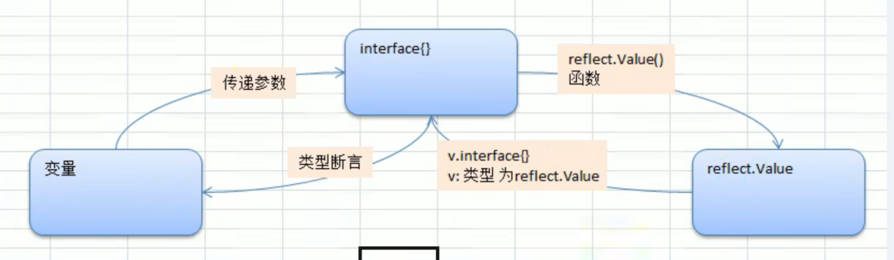
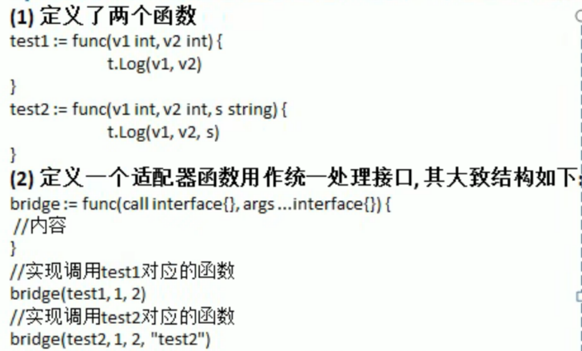

[toc]


# 一、不同类型的反射

> 变量、interface{}、reflect.Value三者之间可以相互转换



### 1) 基本数据类型的转换 反射

1.基本数据类型,interface(),reflet.Value之间的相互转换

> reflect.TypeOf() 返回的类型的 reflect.Type
>
> - 虽然print出来看到的值是 比如rVal = 100， 但是这个100不是传统类型，不能用于 
>
>   rVal + 22 : miss mathch reflect.Type and int 两个不同的类型不能相加
>
> - 要想相加需要将reflect.Value类型转换成对应的基本类型才可以，比如上面的rVal.Int()
>
>   - 或者用类型断言实现Type转换成int类型

```go
// 练习1：对基本数据类型,interface(),refletValue的基本反射操作

// 专门演示反射操作
func testReflect01(b interface{}) {
	// 1. 获取reflect.Type
	rType := reflect.TypeOf(b)
	fmt.Println("rType=", rType) //rType= int

	// 2. 获取reflect.Value 获取变量的reflect值，对应的值是reflect.Value这个类型
	rVal := reflect.ValueOf(b)
	fmt.Printf("rVal:%v, rVal Type:%T\n", rVal, rVal) //rVal:100, rVal Type:reflect.Value
	// 2.1 将reflect.Type转换成对应传统类型才能和传统类型相加，否则类型不匹配
	// num := rVal + 100 : cannot convert 100 (untyped int constant) to reflect.Value
    //下面是转换成传统类型的办法
	// 方法一：通过reflect包类型转换
	num1 := 20 + rVal.Int()

	// 方法二：通过类型断言 转换： 先将reflect变量转为interface
	rValInter := rVal.Interface()
	num2 := 20 + rValInter.(int)

	fmt.Printf("num1=%d, num2=%d", num1, num2)

}
```


### 2) 结构体的反射

2.结构体,interface(),reflect.Value之间的转换

> 不能直接通过value.interface()获取到结构体,并通过它来直接方法结构体里面的字段。
>
> 而需要对interface()后进行类型断言，来获取结构体里面的字段

```go
rVal := reflect.ValueOf(b) 

//直接获取reflect.Value对象的值是不行的，反射是发生在运行阶段，而不是便一阶段
rInter := rVal.Interface()// rInter.Name undefined (type any has no field or method Name)

//类型断言获取结构体内的值
stu := rInter.(Student)

fmt.Println(stu.Name) //输出tom
```

**全部代码**

```go
// 专门演示反射[结构体类型]
func testReflect02(b interface{}) {
	// 1. 获取reflect.Type
	rType := reflect.TypeOf(b)
	fmt.Println("rType=", rType) //rType = main.Student

	// 2. 获取relect.Value
	rVal := reflect.ValueOf(b)
	fmt.Printf("rVal:%v, rVal Type:%T\n", rVal, rVal) //{tom 20}, main.Student

	// 2.1 获取结构体里面的值
	// 2.1.1 错误写法:转换成interface{}直接获取里面的值：反射处于运行阶段，在编译阶段无法反射获取到值
	rInter := rVal.Interface()
	// rInter.Name undefined (type any has no field or method Name)

	// 2.1.2 类型断言以获取结构体中的值
	stu := rInter.(Student)
	// switch rInter.(type) {
	// case Student:
	// 	fmt.Println(stu.Name) //输出tom
	// default:
	// 	fmt.Println("others")
	// }
	fmt.Println(stu.Name) //输出tom
}

type Student struct {
	Name string
	Age  int
}
```

#### 不确定结构体类型，用switch...case

用switch case获取结构体

```go
switch rInter.(type) {
    case Student:
    	fmt.Println(stu.Name) //输出tom
    default:
    	fmt.Println("others")
}
```


# 二、结构体相关

## 1) 遍历Struct字段、Tag


> **具体获取的是什么？**
>
> ```go
> type Student struct {
>  Name   string `json:"your name is" other:"gogogo"`
>  Age    int    `json:"your age is "`
> }
> ```
>
> - tag 是 `json:"your name is" other:"gogogo"`一整条，通过tag.Get("key")获取指定值，比如 tag.Get("json")获取到 your name is
>
> - 字段 是 传入变量的实际值，比如 stu{Name:"bb", Age:"88"},获取到bb 88
>
>   val.Field(0) == bb,  val.Field(1) == 88
>
> **获取Tag、字段的步骤：**
>
> 1. `val.NumField()` 获取结构体有多少个字段
>
> 2. 遍历整个Struct的所有Tag
>    1. reflect.ValueOf(struct).Field(i) 获取结构体字段
>    2. reflect.TypeOf(struct).Field(i).Tag.Get("key") 获取结构体Tag名


**核心代码**：

```go
// 先转成reflect
	val := reflect.ValueOf(b)
	typ := reflect.TypeOf(b)
	// 1. 获取该结构体有多少个字段
	num := val.NumField()
	// 2. 遍历结构体所有字段
	for i := 0; i < num; i++ {
		// 2.1 获取字段对应的Tag：通过Type.Field来获取Tag， Val.Field获取字段的值
		tag := typ.Field(i).Tag.Get("json") //Filed获取Tag，每个Tag有多个字段，我们要获取json字段
```

**全部代码**

```go
type Student struct {
	Name   string `json:"your name is" other:"gogogo"`
	Age    int    `json:"your age is "`
	sex    int
	height int
}

func testStruct(b interface{}) {
	// ======= 获取结构体字段 ========

	// 先转成reflect
	val := reflect.ValueOf(b)
	typ := reflect.TypeOf(b)
	// 1. 获取该结构体有多少个字段
	num := val.NumField()
	// 2. 遍历结构体所有字段
	for i := 0; i < num; i++ {
		// 2.1 获取字段对应的Tag：通过Type.Field来获取Tag， Val.Field获取字段的值
		tag := typ.Field(i).Tag.Get("json") //Filed获取Tag，每个Tag有多个字段，我们要获取json字段
		// 2.2 判断Tag是否存在：比如上面sex就没有Tag，如果Tag存在就显示
		if tag != "" {
			fmt.Printf("filed:%v", val.Field(i)) //Val.Field获取字段的值
			fmt.Printf(", Tag:%v\n", tag)
		}
	}
}
func main() {
	var stu Student = Student{
		Name: "费主张",
		Age:  99,
		sex:  1,
	}
	// 调用通用函数
	testStruct(stu)
}

```


## 2) 调用结构体的方法

#### 理论

一个结构体对应了多个方法，方法会自动排序编号，我们可以通过编号调用对应方法。

- 编号方式是函数名的ASCII码，跟函数定义的顺序没有关系
- 方法的传参and返回参数是一个reflect.Value类型的切片

> **调用结构体方法的步骤：**
>
> 1. `val.NumMethod()` 获取Struct的方法个数
>
> 2. `val.Method(0)` 获取Struct的第i个方法
>
> 3. `val.Method(0).Call(nil)` 调用第i个方法
>
> 4. 对于需要传入参数、返回结果的Method，我们可以传入参数切片、获取返回的结果切片。将要传入的参数封装成[]reflect.Value
>
>    ```go
>    //将要传入的参数转换后添加进切片
>    var params []reflect.Value
>    params = append(params, reflect.ValueOf(10))
>    params = append(params, reflect.ValueOf(999))
>       
>    //获取返回的结果切片
>    res := val.Method(2).Call(params)
>    res[0].Int()
>    ```


#### **1） 具体调用的实现**

```go
// ======== 调用结构体对应的方法 ===========
	// 1. 获取到有多少个方法
	numOfMethod := val.NumMethod()
	fmt.Printf("struct has %d method\n", numOfMethod)

	// 2. 调用方法
	//method按照函数名的ASCII 排序
	val.Method(0).Call(nil) //按照排序第一个APrint()

	//3. 调用传参 调用第3个方法Method(2)
	// 传入 返回的参数都是 []reflect.Value()的切片
	// 1）声明传入参数的切片
	var params []reflect.Value
	// 2）将要传入的参数转换后添加进切片
	params = append(params, reflect.ValueOf(10))
	params = append(params, reflect.ValueOf(999))
	// 3） 传参调用
	res := val.Method(2).Call(params)
	// 4）接收返回来的切片
	fmt.Println("返回来的值：", res[0].Int()) //因为我们已经知道是Int类型所以直接转换
```


#### **2） 全部代码**

```go
package main

import (
	"fmt"
	"reflect"
)

// 获取变量结构体字段

type Student struct {
	Name   string `json:"your name is" other:"gogogo"`
	Age    int    `json:"your age is "`
	sex    int
	height int
}

// Struct对应的几个方法
func (s Student) CGetNum(num1, num2 int) int {
	return num1 + num2
}

func (s Student) BSet() string {
	return s.Name
}

// 显示s的值
func (s Student) APrint() {
	fmt.Println("start=====")
	fmt.Println(s) //{费主张 99 1 0}
	fmt.Println("end=====")
}
func testStruct(b interface{}) {
	// 先转成reflect
	val := reflect.ValueOf(b)
	typ := reflect.TypeOf(b)
	
    // ======== 调用结构体对应的方法 ===========
	// 1. 获取到有多少个方法
	numOfMethod := val.NumMethod()
	fmt.Printf("struct has %d method\n", numOfMethod)

	// 2. 调用方法
	//method按照函数名的ASCII 排序
	val.Method(0).Call(nil) //按照排序第一个APrint()

	//3. 调用传参 调用第3个方法Method(2)
	// 传入 返回的参数都是 []reflect.Value()的切片
	// 1）声明传入参数的切片
	var params []reflect.Value
	// 2）将要传入的参数转换后添加进切片
	params = append(params, reflect.ValueOf(10))
	params = append(params, reflect.ValueOf(999))
	// 3） 传参调用
	res := val.Method(2).Call(params)
	// 4）接收返回来的切片
	fmt.Println("返回来的值：", res[0].Int()) //因为我们已经知道是Int类型所以直接转换

}
func main() {
	var stu Student = Student{
		Name: "费主张",
		Age:  99,
		sex:  1,
	}
	// 调用通用函数
	testStruct(stu)
}

```


## 3) 修改字面值

- 修改普通类型
- 修改结构体里面的类型

> 修改字面值需要传入地址；
>
> - 对于地址获取各种信息需要val.Elem()获取指针对应的值, 然后再修改
>
>   ```go
>   //获取字面值并修改
>   val.Elem().Field(0).SetString("安陵容") 
>   ```
>
> - function在接收param时需要判断传入的是否是 地址 and struct
>
>   ```go
>   kd := val.Kind()
>   	if kd != reflect.Ptr && val.Elem().Kind() == reflect.Struct { 
>   ```


**全部代码**

```go
func testStruct(b interface{}) {
	val := reflect.ValueOf(b)
	typ := reflect.TypeOf(b)

	// 0.判断传入的是否是地址，是否是结构体
	kd := val.Kind()
	if kd != reflect.Ptr && val.Elem().Kind() == reflect.Struct { //已经是指针的情况下，获取kind
		// 不是一个指针，但好歹传入的是结构体
		fmt.Println("expect ptr")
		return
	}
	
	// 1. 修改字面值
	val.Elem().Field(0).SetString("安陵容") //获取字面值并修改
	val.Elem().Field(1).SetInt(88)
    
    // 2. 遍历Tag标签  用.Elem()
	num := val.Elem().NumField()
	for i := 0; i < num; i++ {
		tag := typ.Elem().Field(i).Tag.Get("json")
		if tag != "" {
			//获取字段值
			fmt.Printf("值：%v, Tag:%v\n", val.Elem().Field(i), tag) //值：安陵容, Tag:your name is
		}
	}
}
```


# 三、创建适配器:多个函数同一个接口

**要实现的事情**：

- 用同一个Bridge去调用不同的函数

  实现Bridge(Method1, param1, param2)  Bridge(MethodName2, param1)调用两个不同函数




## 1）调用函数的方法

> - **调用方法**：用函数名对应reflect.Value来调用,下面是两种方法
>
>   ```go
>   reflect.ValueOf(MethodName).Call(params)
>   reflect.ValueOf(structName).Method(i).Call(params)
>   比如：
>   reflect.ValueOf(call interface{}).Call(params)
>   ```
>
> - 如何组装Method需要的参数？
>
>   适配器接收一大堆参数，将所有参数放入[]reflect.Value{}切片即可。 同理，返回多个值也是一个切片
>
>   ```go
>   params := []reflect.Value{}
>   for _, arg := range args {
>       params = append(params, reflect.ValueOf(arg))
>   }
>   ```
>
> 

## 2）适配器

1. 组装好需要传入的参数
2. 获取到函数名，并转换成reflect.Value类型
3. .Calld() 调用

```go
func Bridge(call interface{}, args ...interface{}) {
	// 1. 组装好args
	params := []reflect.Value{}
	for _, arg := range args {
		params = append(params, reflect.ValueOf(arg))
	}
	// 2. 获取函数名
	method := reflect.ValueOf(call)
    
	// 3. 通过函数名对应的reflect.Value来Call调用函数
	method.Call(params)
}
```


**全部代码**

```go
// 定义一个适配器Bridge作为两个函数的统一接口，传入不同函数名调用不同的函数
// 实现Bridge(Method1, param1, param2)  Bridge(MethodName2, param1)调用两个不同函数

// 准备两个等待调用的函数
func Call1(num1, num2 int) int {
	fmt.Printf("Call1: %d + %d = %d\n", num1, num2, num1+num2)
	return num1 + num2
}

func Call2(num1, num2 int, more string) {
	fmt.Printf("Call2: %d - %d = %d //%s", num1, num2, num1-num2, more)

}

// 适配器
func Bridge(call interface{}, args ...interface{}) {
	// 1. 组装好args
	params := []reflect.Value{}
	for _, arg := range args {
		params = append(params, reflect.ValueOf(arg))
	}
	// 2. 获取函数名
	method := reflect.ValueOf(call)
    
	// 3. 通过函数名对应的reflect.Value来Call调用函数
	method.Call(params)
}

func main() {
	// 通过调用适配器来调用两个函数
	Bridge(Call1, 1, 2)
	Bridge(Call2, 9, 10, "这是备注")
}
======================输出=================
Call1: 1 + 2 = 3
Call2: 9 - 10 = -1 //这是备注
```


