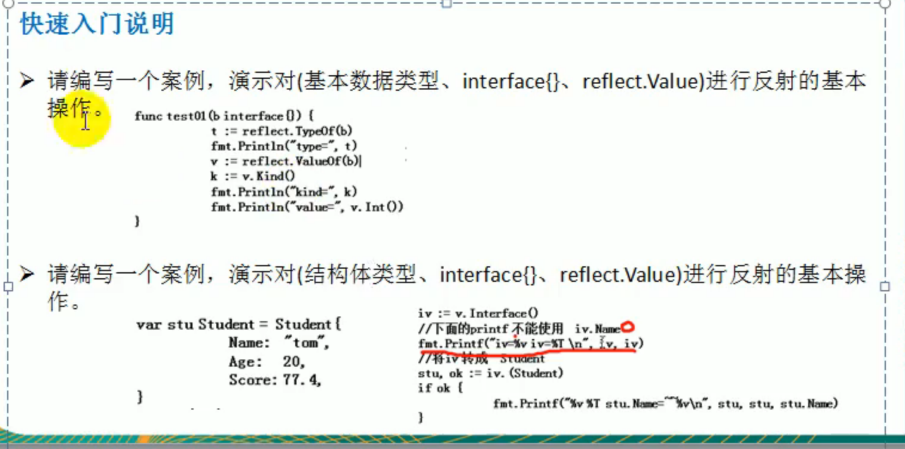
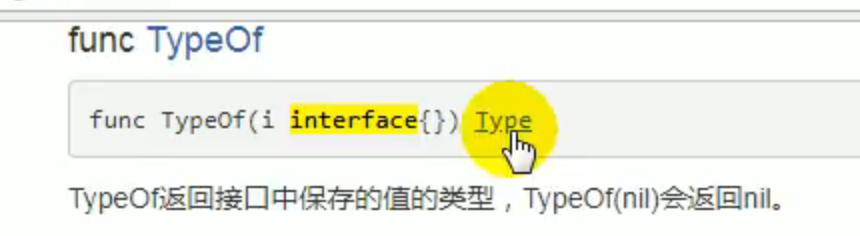
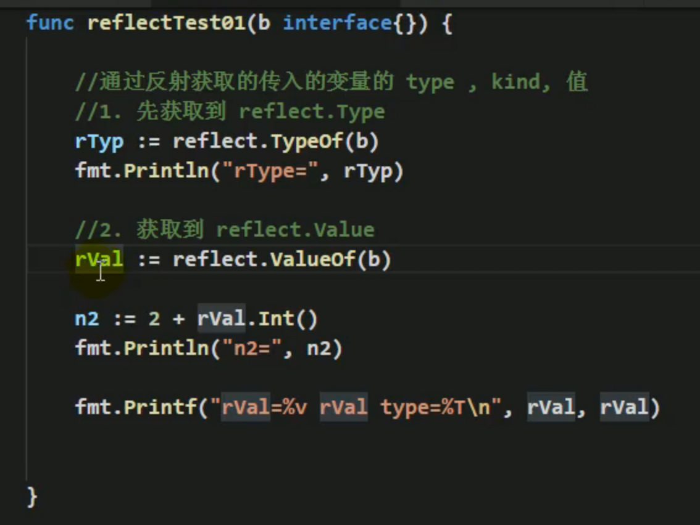
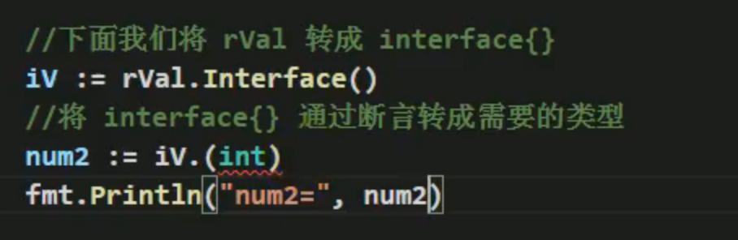
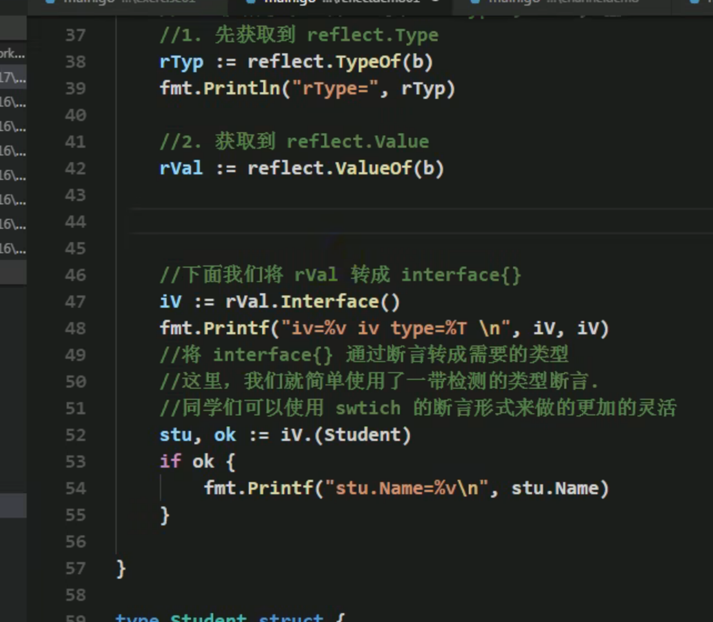
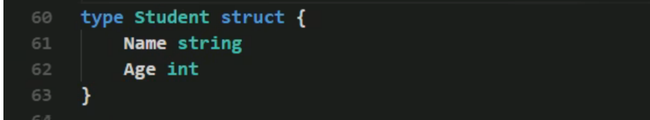
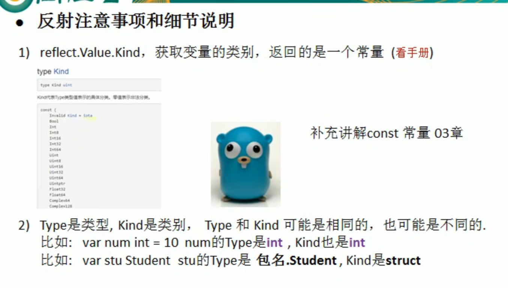
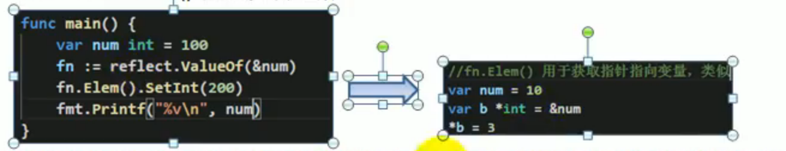

> **主要内容**
>
> 通过反射获取传入参数的type， kind， 值

# 案例一、基本数据类型的反射

> 基本数据类型,interface(),reflet.Value之间的相互转换





返回的看到的是int类型，实际上是 Type类型






reflect.ValueOf() 返回的类型是reflect.Value类型

reflect.TypeOf() 返回的类型的 reflect.Type

- 虽然print出来看到的值是 比如rVal = 100， 但是这个100不是传统类型，不能用于 

  rVal + 22 : miss mathch reflect.Type and int 两个不同的类型不能相加

- 要想相加需要将reflect.Value类型转换成对应的基本类型才可以，比如上面的rVal.Int()

  - 或者用类型断言实现Type转换成int类型

    

### 源码

```go
// 练习1：对基本数据类型,interface(),refletValue的基本反射操作

// 专门演示反射操作
func testReflect01(b interface{}) {
	// 1. 获取reflect.Type
	rType := reflect.TypeOf(b)
	fmt.Println("rType=", rType) //rType= int

	// 2. 获取reflect.Value 获取变量的reflect值，对应的值是reflect.Value这个类型
	rVal := reflect.ValueOf(b)
	fmt.Printf("rVal:%v, rVal Type:%T\n", rVal, rVal) //rVal:100, rVal Type:reflect.Value
	// 2.1 将reflect.Type转换成对应传统类型才能和传统类型相加，否则类型不匹配
	// num := rVal + 100 : cannot convert 100 (untyped int constant) to reflect.Value
    //下面是转换成传统类型的办法
	// 方法一：通过reflect包类型转换
	num1 := 20 + rVal.Int()

	// 方法二：通过类型断言 转换： 先将reflect变量转为interface
	rValInter := rVal.Interface()
	num2 := 20 + rValInter.(int)

	fmt.Printf("num1=%d, num2=%d", num1, num2)

}
```


# 案例二、对结构体的反射

- 反射的本质是运行时的，因此在编译阶段是拿不出来结构体里面的元素的。 只有在运行的时候才知道

  > 报错：
  >
  > rInter := rVal.Interface()
  > // rInter.Name undefined (type any has no field or method Name)

  ```go
  //获取结构体变量
  rVal := reflect.ValueOf(b) 
  
  //直接获取reflect.Value对象的值是不行的，反射是发生在运行阶段，而不是便一阶段
  rInter := rVal.Interface()
  // rInter.Name undefined (type any has no field or method Name)
  //类型断言获取结构体内的值
  stu := rInter.(Student)
  fmt.Println(stu.Name) //输出tom
  ```
  
- 先类型断言为对应的结构体，再才能取出里面的值






```go
// 专门演示反射[结构体类型]
func testReflect02(b interface{}) {
	// 1. 获取reflect.Type
	rType := reflect.TypeOf(b)
	fmt.Println("rType=", rType) //rType = main.Student

	// 2. 获取relect.Value
	rVal := reflect.ValueOf(b)
	fmt.Printf("rVal:%v, rVal Type:%T\n", rVal, rVal) //{tom 20}, main.Student

	// 2.1 获取结构体里面的值
	// 2.1.1 错误写法:转换成interface{}直接获取里面的值：反射处于运行阶段，在编译阶段无法反射获取到值
	rInter := rVal.Interface()
	// rInter.Name undefined (type any has no field or method Name)

	// 2.1.2 类型断言以获取结构体中的值
	stu := rInter.(Student)
	// switch rInter.(type) {
	// case Student:
	// 	fmt.Println(stu.Name) //输出tom
	// default:
	// 	fmt.Println("others")
	// }
	fmt.Println(stu.Name) //输出tom
}

type Student struct {
	Name string
	Age  int
}
```


### 用switch case获取结构体

```go
switch rInter.(type) {
    case Student:
    	fmt.Println(stu.Name) //输出tom
    default:
    	fmt.Println("others")
}
```


# 三、反射的注意事项




### 1. Kind ： 类别 

1） **kind获取变量的类别**，本质上kind是一个常量

- 比如结构体Student是一个类型， struct就是他的类别。

​	[具体的类别在官方文档中是const常量：Kind](https://studygolang.com/static/pkgdoc/pkg/reflect.htm#Kind)

2） **kind与Type可能是相同or可能是不同的**

- 当变量是基本类型时相同：var num int = 100 ： kind = type = int
- 当变量是结构体or其他时候：var stu Student : kind=`struct`(结构体), type=`Student`(结构体名)

#### 获取类别的方法：

- 通过reflect.Type  reflect.Value来获取都是一样可以获取到

```go
func testReflect02(b interface{}) {
	rType := reflect.TypeOf(b)
	rVal := reflect.ValueOf(b)

	// 3. 获取变量对应的kind
	kind1 := rType.Kind()
	kind2 := rVal.Kind()
	fmt.Printf("kind1=%v, kind2=%v\n", kind1, kind2)//kind1=struct, kind2=struct
```


### 2. `变量`在`reflect.Value`和`interface{}`相互转换

- 反射可以让`变量`在`reflect.Value`和`interface{}`相互转换


### 3. 反射获取变量的值必须要求数据类型匹配

> 如果不匹配会运行时报错,比如变量是int类型就应该用`reflect.ValueOf(b).Int()`

`panic: reflect: call of reflect.Value.Float on int Value`将错误的Float应用在了int类型上


如下，当传入的b是int类型， 那么后面在获取时就应该对应.Int()

```go
func test(b interface{}){
    reflect.ValueOf(b).Int() 
    reflect.ValueOf(b).float() //panic: reflect: call of reflect.Value.Float on int Value
}
```


### 4. 反射修改变量的值

- 必须首先判断传入的变量是否是一个地址(传入指针)，否则无法改变

> 当使用SetXxx()设置需要通过对应的指针类型完成，并且使用`reflect.ValueOf(b interface{}).Elem()`方法来修改
>
> - [调用对象].SetXxx(要修改的值) ： 调用对象和要修改的值必须是同一个类型
> - reflect.ValueOf(b)获得的是一个地址，而不是b的值
> - .Elem()：因此要用reflect指针变量的值(b的reflectVal的值)

**错误的做法：**

- 直接改变会报错：

  panic: reflect: reflect.Value.SetInt using unaddressable value

```go
var b int = 100
rVal := reflect.ValueOf(b) //获取到的是b的地址
rVal.SetInt(20) //此时相当于是将地址改编为20
```

**正确的改变值：**

```go
var b int = 100
rVal := reflect.ValueOf(&b) //获取到的是b的地址,并且修改
rVal.Elem().SetInt(20) //相当于获取到地址对应的值
```


### 5. reflect.ValueOf().Elem()如何理解

相当于将指针变量的值取出来




