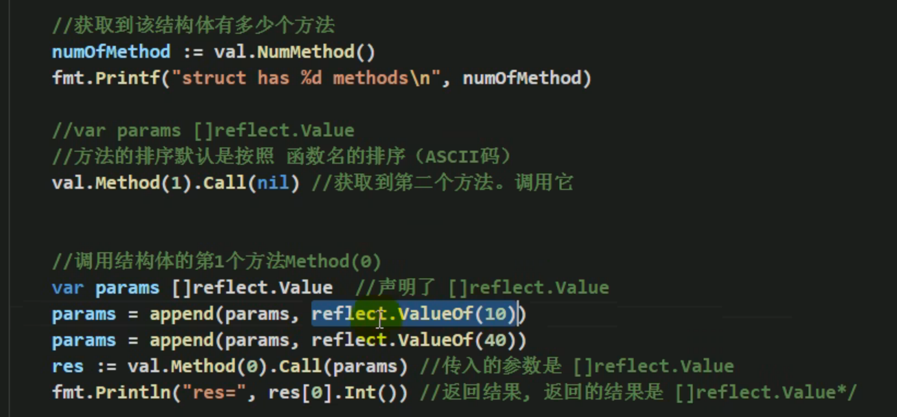

# 1题目1：


```go
// 给一个变量。
// 1.反射获取reflect.Value,
// 2. 获取Type kind 值
// 3. 转换成interface{}, 再将interface转换成Float

func main() {
	var v float64 = 1.2
	// 1.反射获取reflect.Value,
	rVal := reflect.ValueOf(v)

	// 2. 获取Type kind 值
	rTyp := reflect.TypeOf(v)
	rKin := rVal.Kind()
	elem := rVal.Float() //通过类型断言获取

	// 3. 转换成interface{}, 再将interface转换成Float
	rInter := rVal.Interface()
	rFloat := rInter.(float64)
	fmt.Printf("Type=%v, Kind=%v, ele=%v, rFloat=%v", rTyp, rKin, elem, rFloat)
}

```

# 2最佳实践1:反射遍历结构体字段,调用结构体方法,获取Tag


## 函数解释

#### val.Field()

返回的还是reflect.Value类型(比如int)，可以打印出来但不能运算。 如果要运算就需要类型转换(类型断言or...)

Typ.Field() 返回的不一样


### 2. 调用结构体方法





# 实践2:修改字面值

> 修改字面值需要传入地址；
>
> - 对于地址获取各种信息需要val.Elem()获取指针对应的值, 然后再修改
>
>   ```go
>   //获取字面值并修改
>   val.Elem().Field(0).SetString("安陵容") 
>   ```
>
> 
>
> - function在接收param时需要判断传入的是否是 地址 and struct
>
>   ```go
>   kd := val.Kind()
>   	if kd != reflect.Ptr && val.Elem().Kind() == reflect.Struct { 
>   ```


```go
func testStruct(b interface{}) {
	val := reflect.ValueOf(b)
	typ := reflect.TypeOf(b)

	// 0.判断传入的是否是地址，是否是结构体
	kd := val.Kind()
	if kd != reflect.Ptr && val.Elem().Kind() == reflect.Struct { //已经是指针的情况下，获取kind
		// 不是一个指针，但好歹传入的是结构体
		fmt.Println("expect ptr")
		return
	}
	// 1. 遍历Tag标签.Elem()
	num := val.Elem().NumField()
	// 2. 修改字面值
	val.Elem().Field(0).SetString("安陵容") //获取字面值并修改
	val.Elem().Field(1).SetInt(88)
	for i := 0; i < num; i++ {
		tag := typ.Elem().Field(i).Tag.Get("json")
		if tag != "" {
			//获取字段值
			fmt.Printf("值：%v, Tag:%v\n", val.Elem().Field(i), tag) //值：安陵容, Tag:your name is
		}
	}
}
```


# 实践3:适配器函数(多个函数统一一个接口)


**1. 调用函数的方法**

> - **调用方法**：用函数名对应reflect.Value来调用,下面是两种方法
>
>   ```go
>   reflect.ValueOf(MethodName).Call(params)
>   reflect.ValueOf(structName).Method(i).Call(params)
>   比如：
>   reflect.ValueOf(call interface{}).Call(params)
>   ```
>
> - 如何组装Method需要的参数？
>
>   适配器接收一大堆参数，将所有参数放入[]reflect.Value{}切片即可。 同理，返回多个值也是一个切片
>
>   ```go
>   params := []reflect.Value{}
>   for _, arg := range args {
>       params = append(params, reflect.ValueOf(arg))
>   }
>   ```
>
>   


```go
// 定义一个适配器Bridge作为两个函数的统一接口，传入不同函数名调用不同的函数
// 实现Bridge(Method1, param1, param2)  Bridge(MethodName2, param1)调用两个不同函数

// 准备两个等待调用的函数
func Call1(num1, num2 int) int {
	fmt.Printf("Call1: %d + %d = %d\n", num1, num2, num1+num2)
	return num1 + num2
}

func Call2(num1, num2 int, more string) {
	fmt.Printf("Call2: %d - %d = %d //%s", num1, num2, num1-num2, more)

}

// 适配器
func Bridge(call interface{}, args ...interface{}) {
	// 1. 组装好args
	params := []reflect.Value{}
	for _, arg := range args {
		params = append(params, reflect.ValueOf(arg))
	}
	// 2. 获取函数名
	method := reflect.ValueOf(call)
	// 3. 通过函数名对应的reflect.Value来Call调用函数
	method.Call(params)
}

func main() {
	// 通过调用适配器来调用两个函数
	Bridge(Call1, 1, 2)
	Bridge(Call2, 9, 10, "这是备注")
}
======================输出=================
Call1: 1 + 2 = 3
Call2: 9 - 10 = -1 //这是备注
```


# 作业


> - 作业是对前面的总和，没啥好说的

Tom是通过 Getsub传参进去的

8 3 是通过设置放进去的：结构体设置好后调用


```go
package main

import (
	"fmt"
	"reflect"
)

// 1. Cal结构体有两个字段Num1 Num2
// 2. 调用函数(c Cal) GetSum(name string) : 输出 name 运行了减法 num1 - num2 = num
// 3. 遍历结构体所有字段信息
// 4. 反射机制完成对函数的调用

type Cal struct {
	Num1 int `json:"num1"`
	Num2 int `json:"num2"`
}

func (c Cal) GetSum(name string) {
	fmt.Printf("%s 运行了减法 %d - %d = %d", name, c.Num1, c.Num2, c.Num1-c.Num2)
}

// testStruct可以：遍历结构体并输出值；设置结构体字段的值， Tag的值；调用GetSum
func testStruct(stc interface{}, name string, num1, num2 int64) {
	val := reflect.ValueOf(stc)
	typ := reflect.TypeOf(stc)

	// 0 判断传入的是否是地址orStruct
	kd := val.Kind()
	if kd != reflect.Ptr && val.Elem().Kind() == reflect.Struct {
		fmt.Println("expect struct!")
		return
	}
	// 1. 修改结构体对象的字段值
	val.Elem().Field(0).SetInt(num1)
	val.Elem().Field(1).SetInt(num2)

	// 2.遍历结构体字段 Tag
	// 2.1 获取有多少个字段
	num := val.Elem().NumField()
	// 2.2 遍历
	for i := 0; i < num; i++ {
		field := val.Elem().Field(i)
		tag := typ.Elem().Field(i).Tag.Get("json")
		fmt.Printf("Tag : %v 对应 Field值: %v\n", tag, field)
	}

	// 3. 调用GetSum
	params := []reflect.Value{reflect.ValueOf(name)}
	val.Elem().Method(0).Call(params)
}
func main() {
	call := Cal{}
	var (
		num1 int64 = 99
		num2 int64 = 55
	)
	testStruct(&call, "BigRain", num1, num2)
}
=================输出===============
Tag : num1 对应 Field值: 99
Tag : num2 对应 Field值: 55
BigRain 运行了减法 99 - 55 = 44
```

