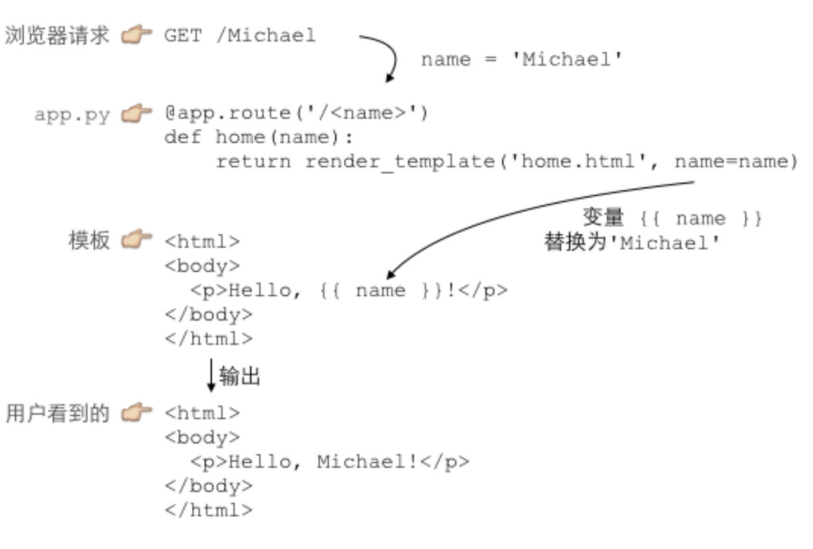

# 一、什么是模板

[廖雪峰说模板](https://www.liaoxuefeng.com/wiki/1016959663602400/1017806952856928)

一个html文件中嵌入一些可变的变量、指令；

根据后端传入的数据，替换这些变量指令；

最终得到用户可以见到的HTML页面；



### 结合MVC说明

view：上面的包含变量的模板就是view 视图

Controller ： 处理用户请求的URL的就是控制器

Models：`Models`是用来将数据传给view的，view在替换变量时，从model中取出数据


# 二、Go模板创建写入实例

[参考：模板快速入门指南](https://bbs.huaweicloud.com/blogs/334515)

`main.go`解析模板；构造模板所需要的数据实例；将构建好的数据实例传入到模板中


1. 同时创建 `hello.html`模板 与 `main.go`文件
2. 运行`main.go`


**`hello.html`**

```html
<h1>Hello, {{.Name}}!</h1>
```

**`main.go`**

```go
package main
import (
	"html/template"
	"os"
)

func main() {
	// 1.解析模板==========================
	t, err := template.ParseFiles("hello.gohtml") //模板相对路径
	if err != nil {
		panic(err)
	}
	// 2.构建数据==================
	// data是要传给模板的数据model，参数名需要与模板中参数一一对应
	type data struct {
		Name string
	}
	// 构建传入内容的结构体
	d := data{Name: "John Smith"}

	// 3.将数据写入到模板中=========================
	err = t.Execute(os.Stdout, d)
	if err != nil {
		panic(err)
	}
}
```


**运行结果**

```shell
[Running] go run "/home/yang/go/src/Spike-Product/main.go"
<h1>Hello, John Smith!</h1>
```

