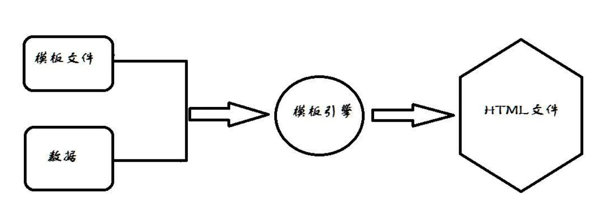

# 一、什么是模板引擎

[五分钟了解模板引擎原理](https://www.jianshu.com/p/9091e8a343e4)

模板引擎的作用：将 **模板文件** 填充 **数据** 得到最终需要的 **HTML文件** 




# 二、Go原生定义模板引擎

[知乎](https://zhuanlan.zhihu.com/p/299048675)

### 1 使用

Go中模板引擎使用有三步骤：

1. 定义模板文件：

   创建模板文件 xxx.html

2. 解析模板文件:

   将文件解析得到模板对象

   ```go
   func ParseFiles(filenames ...string) (*Template, error)

3. 渲染模板文件: 

   将数据`data`写入到模板(`*Template`)中，渲染完毕后输出到io.Writer(`wr`)

   ```go
   func(t *Template) Execute(wr io.Writer, data interface) error
   ```


### 2 **实例**

```go
// main.go
func sayHello(w http.ResponseWriter, r *http.Request) {
    // 1.=================1. 解析指定文件生成模板对象==============================
    tmpl, _ := template.ParseFiles("./hello.tmpl")
  
    // 2. ================2. 利用给定数据渲染模板, 并将结果写入w==================
    tmpl.Execute(w, "小明") //第二个参数通常是html文件需要的所有data
}

func main() {
    http.HandleFunc("/", sayHello)
    err := http.ListenAndServe(":9090", nil)
    ...
}
```


# 三、Iris的模板引擎